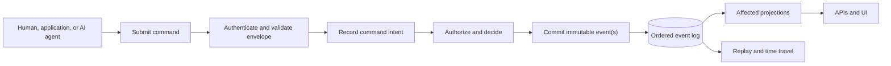

# Hyperkernel

> [!NOTE]
> Hyperkernel is currently in the design phase. The repository contains an early SvelteKit shell and a centralized SQLite connection, but almost none of the platform described here is implemented; the first version is under active development. Until that version is stable, this document describes the intended architecture. It will then be revised to reflect the implemented system.

**An open-source project building a self-hostable application platform for reliable, auditable apps that work together.**

Hyperkernel is building a shared kernel and workspace where developers and organizations can build and run modular applications. The platform is designed to give those applications shared contracts for identity, permissions, state, events, and audit history; together, they can form a software platform tailored to the work they support.

The architecture separates software into two trust zones:

- a small kernel whose contracts are designed to be stable, extensively tested, and reviewed by experienced humans;
- applications, interfaces, workflows, and integrations that can evolve faster, whether built by developers, developers using AI, or AI agents operating within explicit boundaries.

Fast-moving code may extend the system, but it may never bypass the kernel's command, event, authorization, or audit contracts.

## Why Hyperkernel

Most product code does not need the same review cost as the foundation that protects data, history, permissions, and recovery.

Hyperkernel's architecture concentrates the highest assurance in a small core. That core provides the durable rules; everything above it can iterate at a speed appropriate to its risk. The goal is to make AI-assisted development practical without asking users to trust unreviewed code with unrestricted access to authoritative state.

Reliability, auditability, self-hosting, developer experience, and user experience are all platform requirements. None is treated as optional polish.

## Core architecture

Every durable change follows the same path:



### Commands record intent

A command is an immutable record of what an identified actor asked the system to do. Humans, applications, automations, and AI agents all use the same command boundary.

The actor is authenticated and the command envelope is validated and sanitized before durable recording. The command is then authorized and evaluated. A rejected command makes no domain change, but its outcome remains auditable. A committed state-changing command and its events form one outcome; the command never updates authoritative state or a projection directly.

### Events record facts

An event records a fact that the kernel accepted. Events are the source of truth for durable domain state.

Once appended, an event is never edited or deleted. No supported application, administrative, migration, or upgrade path may rewrite it, even when its type or schema version is later deprecated. A mistake is corrected by submitting another command and appending a corrective or compensating event. History remains intact, including the original mistake and its correction.

### Projections build read models

Applications read data through projections. When an event is appended, every projection that declares a dependency on that event is advanced from its checkpoint.

A projection is derived state, never the source of truth. It must be possible to discard it and deterministically rebuild it from the ordered event log. Incremental processing and a clean replay of the same events with the same projection version must produce equivalent results.

The kernel owns projection execution, isolation, checkpointing, rebuild, and cutover. Applications may define their own read models through constrained contracts. A definition crosses into the kernel review boundary when it participates in an authoritative transaction or platform authorization.

Hyperkernel will provide protected APIs and administrative interfaces to rebuild projections from zero, inspect progress and failures, and replace a projection only after a successful rebuild.

### Replay enables recovery and time travel

Replaying events up to a stable event position through a specified compatible projection version reconstructs the system's internal state as interpreted at that point. Preserving an exact historical interpretation also requires preserving the corresponding projection artifact. This enables auditing, debugging, recovery, historical inspection, and time travel without rewriting history.

Replay reconstructs Hyperkernel state; it cannot undo an email already sent, a payment already processed, or another external effect. Those effects require explicit delivery, deduplication, reconciliation, and compensation contracts.

### Versioning enables long-lived evolution

Persisted events have explicit types and schema versions. A new version may replace a deprecated version for future writes, but historical versions remain stored and supported for replay.

Deprecation means “stop producing this version,” never “remove it from history.” Compatibility code may translate an old event in memory, but it may not rewrite the stored record.

## The trust boundary

| Layer      | Examples                                                                                                                                                | Change standard                                                                                          |
| ---------- | ------------------------------------------------------------------------------------------------------------------------------------------------------- | -------------------------------------------------------------------------------------------------------- |
| Kernel     | command processing, authorization, event storage, ordering, concurrency, projection runtime, checkpoints, rebuilds, replay, audit, and public contracts | Stable contracts, compatibility and recovery tests, and approval by an experienced human maintainer      |
| Extensions | domain applications, projection definitions and read models, workflows, integrations, agent tools, and SDK packages                                     | Faster iteration through constrained public kernel contracts, with tests and review proportional to risk |
| Experience | multitasking shell, application UI, administrative UI, and developer tooling                                                                            | Rapid product iteration without bypassing commands, permissions, events, or projection runtime           |

AI may help author code in any layer. It does not lower the review standard. In particular, an AI agent cannot certify or approve a kernel change by itself.

## Humans and AI agents

People, services, and AI agents are actors under the same authorization and command model.

Agents:

- receive explicit identities, capabilities, context, and limits;
- submit commands instead of accessing the database or event log directly;
- leave an auditable record of consequential tool calls, approvals, commands, results, and failures;
- require human approval for operations whose policy or risk demands it;
- correct mistakes through new authorized commands and events, never hidden history edits.

Auditability is not permission to persist secrets or erasable personal data forever. Sensitive information that may need restricted retention or erasure must use an explicit storage, encryption, or indirection design rather than being embedded blindly in immutable event payloads.

## Platform experience

Hyperkernel is intended to provide:

- a self-hostable operational foundation;
- typed, predictable APIs and excellent debugging and replay tooling;
- a friendly multitasking workspace that preserves durable work context;
- interfaces for inspecting commands, events, projections, agent work, and failures;
- a stable kernel that independent developers and small teams can extend without maintaining a private platform fork.

Persistent workspace changes follow the same command and event rules as other durable state. Ephemeral presentation details such as hover state do not need to enter the event log.

## What can be built

Examples include:

- a business operations environment for an independent developer or small company;
- a personal work and routine-management environment for developers;
- auditable workflows in which people and external AI agents collaborate;
- a tailored, self-hosted suite of modular applications intended to run on Hyperkernel.

These are examples, not hard-coded products. Hyperkernel is building the application platform; applications provide the domain.

## Status

Hyperkernel is an early architecture prototype. This document defines the target contract and quality bar, not a claim that the repository is production-ready today.

The repository currently contains:

- an early SvelteKit application shell with a Node.js adapter;
- a centralized server-only SQLite connection using the built-in `node:sqlite` module;
- formatting, type-checking, unit-test, browser-test, build, and CI tooling;
- an isolated event-sourcing and projection spike under `docs/spikes/`.

Commands, the production event store, event versioning, replay, projection rebuilds, time travel, permissions, the public SDK, persistent multitasking, and external agent execution are not implemented yet.

## First milestone

The first milestone is a complete, small vertical slice that proves:

- durable command recording and auditable acceptance or rejection;
- an append-only, versioned event store with actor and causation metadata;
- a deterministic projection runtime with checkpoints, transactional kernel projections, and recoverable extension projections;
- clean projection rebuilds through a protected API and UI;
- historical inspection at a selected event position;
- one useful self-hosted workflow using the same public contracts intended for future applications and agents.

Every kernel primitive must be required by that working flow. Hyperkernel will extract stable primitives from concrete use rather than speculate about a universal platform.

## Getting started

Hyperkernel requires Node.js 24 or later and npm 11 or later.

```sh
npm ci
cp .env.example .env
npm run dev
```

The development server prints its local URL after startup.

## Verification

```sh
npx playwright install chromium
npm run check
npm run lint
npm run test
npm run build
```

## Self-hosting

Self-hosting is a core goal, but the current prototype is not suitable for important production data.

```sh
npm run build
npm start
```

`DATABASE_URL` configures the SQLite connection path. The repository does not yet contain a production event schema, migrations, backup and restore guarantees, or an upgrade contract.

## Contributing

Read [CONTRIBUTING.md](CONTRIBUTING.md) before proposing or implementing a change. Security vulnerabilities must be reported privately according to [SECURITY.md](SECURITY.md). Participation in project spaces is governed by the [Code of Conduct](CODE_OF_CONDUCT.md).

Kernel changes require a higher evidence and review bar than application or interface changes. AI-generated contributions are welcome, but critical contracts must be understood and approved by experienced human maintainers.

## License

Hyperkernel is available under the [MIT License](LICENSE).
