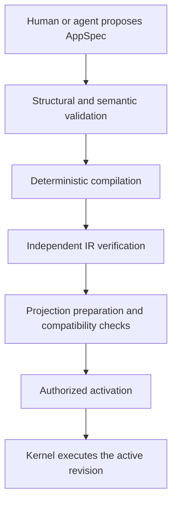

# 0005: Agent-generated application specifications

| Field        | Value      |
| ------------ | ---------- |
| Status       | Draft      |
| Scope        | Kernel     |
| Created      | 2026-07-28 |
| Last updated | 2026-07-28 |

## Summary

Hyperkernel will explore a constrained, immutable, versioned JSON language named
**AppSpec** for defining common application behavior. An AppSpec revision may
declare events, commands, projections, actor-aware queries, views, and UI
interactions. The language is intended for both developers and AI agents, but
its closed and machine-verifiable output space is particularly valuable for
agents.

An AppSpec is untrusted source input. The kernel validates it structurally and
semantically, compiles it deterministically into a versioned intermediate
representation, verifies the result, prepares affected projections, and only
then permits an authorized actor to activate it. Agents may propose revisions;
they cannot submit executable IR, mutate authoritative state, grant themselves
capabilities, or bypass activation policy.

AppSpec targets common operational applications, not every possible program.
Behavior that cannot be represented safely uses explicit, typed, versioned code
extension ports. Those extensions remain subject to the same command, event,
authorization, audit, projection, and external-effect boundaries.

This record defines a proposed Kernel-layer contract. Nothing described here is
implemented or approved for support.

## Problem

Hyperkernel needs applications to evolve faster than the trusted kernel without
allowing fast-moving code or AI-generated output to bypass authoritative
contracts. Arbitrary generated source code is difficult to constrain before
execution: it may access unexpected state, introduce ambient dependencies,
weaken authorization, perform external effects during replay, or create
application-specific behavior that the kernel cannot inspect.

AI agents are substantially more reliable when they produce structured data
against a closed schema. JSON structured output can eliminate syntax ambiguity,
but JSON validity alone does not establish reference integrity, type safety,
authorization coverage, determinism, replay compatibility, bounded execution,
or desirable business policy.

Hyperkernel therefore needs a protocol that separates three concerns:

1. an application definition suitable for humans and agents to author;
2. a normalized executable representation owned by the kernel; and
3. an activation protocol that proves compatibility without changing the
   currently active application.

The protocol must remain deliberately smaller than a general-purpose language.
If one-off requirements continually add arbitrary expressions, callbacks,
network access, or embedded source code, the DSL becomes a less predictable
programming language and loses its main advantage.

## Invariants

1. An AppSpec is untrusted data, even when it satisfies its JSON schema.
2. Humans and agents propose AppSpec revisions through authenticated commands.
3. An agent cannot activate a revision or expand its own capabilities merely by
   declaring them.
4. Durable application state changes only through committed commands and
   immutable events.
5. Views submit commands and read actor-aware queries; they never mutate events
   or projections directly.
6. Projections remain deterministic, disposable, checkpointed, and rebuildable
   from the ordered event log.
7. Historical event types and schema versions remain interpretable while their
   events exist.
8. AppSpec revisions are immutable. Every material change creates a new
   revision with a new identity.
9. Stable IDs define durable identity. Names and labels are presentation
   metadata and may change only in a new revision.
10. Only the kernel compiler produces IR, and only verified IR associated with
    an active revision may execute.
11. Identical canonical source and compiler versions produce identical IR and
    hashes.
12. AppSpec cannot redefine platform authorization, event ordering, storage,
    transactions, replay, audit, or external-effect delivery.
13. Queries are bounded and actor-aware. Hiding a field or control in a view is
    never authorization.
14. Code extensions cannot receive direct authoritative-table or
    projection-table write access.
15. A failed validation, preparation, or activation leaves the current revision
    and its readable projections unchanged.

## Decision

### Treat AppSpec as an application protocol

Hyperkernel will explore the following pipeline:



The AppSpec language, compiler, IR verifier, interpreter, and activation
protocol are kernel contracts. Individual AppSpec revisions are application
definitions executed inside those contracts. They cannot introduce new kernel
instructions or capabilities.

The initial top-level language shape is:

```json
{
  "languageVersion": 1,
  "app": {
    "id": "contacts",
    "name": "Contacts"
  },
  "events": {},
  "commands": {},
  "projections": {},
  "queries": {},
  "views": {}
}
```

Top-level maps use stable IDs as keys. The compiler rejects duplicate IDs,
missing references, unsupported dependency cycles, ambiguous defaults, and
unreachable declarations that indicate a likely generation error.

### Keep revisions immutable and activation explicit

An application has a stable `appId`. Each proposal creates a new immutable
revision containing at least:

- application and revision identities;
- AppSpec language version;
- canonical source JSON and its content hash;
- parent revision, when applicable;
- proposing actor and originating command;
- compiler and IR versions and hashes;
- required kernel and extension capabilities;
- validation and preparation evidence;
- approval and activation history; and
- kernel-recorded creation time.

The canonical JSON representation must have specified key ordering, string,
number, and whitespace rules so semantically identical source cannot have
ambiguous identities. A revision identity is derived from or cryptographically
bound to that canonical content.

Application-revision lifecycle changes use commands and events. Candidate
command names include `ProposeAppRevision`, `PrepareAppRevision`,
`ApproveAppRevision`, `ActivateAppRevision`, `DeactivateAppRevision`, and
`RollbackAppRevision`; exact command design remains future work. Activation is
never a hidden mutable database update.

The initial implementation should keep canonical AppSpec source in the
immutable event payload so the ordered event log remains sufficient to recover
the application definition. Moving large source bodies to content-addressed
storage would make that storage part of the authoritative recovery boundary and
requires a separate backup, retention, and replay contract.

### Separate AppSpec from IR

AppSpec is the durable, human-inspectable authoring contract. IR is a normalized
deployment artifact optimized for kernel execution.

The compiler must:

- accept one declared AppSpec language version;
- resolve stable references;
- infer and check all expression and mapping types;
- make every default explicit;
- normalize schemas and dependency graphs;
- derive required capabilities and resource limits;
- emit identical IR for identical canonical source and compiler versions; and
- retain AppSpec source paths for every diagnostic and IR instruction.

Agents never submit IR. The runtime never interprets unchecked AppSpec source.
Before execution, the kernel verifies the canonical source hash, compiler
version, IR version, IR hash, required capabilities, and activation identity.

IR is reproducible and replaceable. Hyperkernel does not promise to execute
every historical IR representation forever. It must preserve supported AppSpec
semantics through retained compilers or explicit and tested compiler migration
paths.

### Declare events as versioned facts

An event declaration defines a stable event type, schema version, payload
schema, subject identity contract, and deprecation state.

Event names are past-tense facts. An existing event type and schema version
never changes meaning or payload contract. A later AppSpec revision may stop
emitting an old version, but historical versions remain supported for replay.
An in-memory compatibility adapter may expose a canonical representation to
consumers without rewriting the stored event.

Kernel-owned envelope fields such as event identity, stable replay position,
actor, kernel-recorded time, originating command, causation, correlation, and
subject version are not authored by AppSpec.

### Treat commands as the transactional decision boundary

A command declaration defines:

- stable imperative identity;
- input schema;
- required actor capabilities;
- explicit decision inputs;
- authorization policy;
- domain rules and invariants;
- idempotency contract;
- expected subject version or another concurrency contract; and
- possible emitted event types and typed payload mappings.

For example:

```json
{
  "commands": {
    "CreateContact": {
      "input": {
        "type": "object",
        "properties": {
          "contactId": { "type": "id" },
          "organizationId": { "type": "id" },
          "name": {
            "type": "string",
            "minLength": 1,
            "maxLength": 200
          }
        },
        "required": ["contactId", "organizationId", "name"]
      },
      "decisionInputs": {
        "organization": {
          "query": "OrganizationForDecision",
          "arguments": {
            "organizationId": { "ref": "input.organizationId" }
          }
        }
      },
      "authorize": {
        "op": "and",
        "args": [
          {
            "op": "hasCapability",
            "actor": { "ref": "actor" },
            "capability": "contacts:create"
          },
          {
            "op": "eq",
            "left": { "ref": "organization.tenantId" },
            "right": { "ref": "actor.tenantId" }
          }
        ]
      },
      "idempotencyKey": { "ref": "input.contactId" },
      "expectedVersion": { "literal": 0 },
      "emit": [
        {
          "type": "ContactCreated",
          "version": 1,
          "subject": { "ref": "input.contactId" },
          "payload": {
            "contactId": { "ref": "input.contactId" },
            "organizationId": { "ref": "input.organizationId" },
            "name": { "ref": "input.name" }
          }
        }
      ]
    }
  }
}
```

Identity, received time, and any other nondeterministic execution context are
provided and durably recorded by the kernel. Expressions cannot read ambient
time, generate randomness, access global state, or call external services.

A committed state-changing command appends its events and final decision
atomically with required synchronous kernel projections and checkpoints. A
rejected command appends no domain-state event. AppSpec cannot weaken these
semantics.

### Distinguish decision and read projections

A projection declaration defines its stable identity and version, consumed
event versions, schema, indexes, uniqueness constraints, deterministic reducers,
consistency classification, resource limits, and rebuild expectations.

AppSpec distinguishes:

- **decision projections**, whose state may participate in authorization or
  command decisions and must satisfy the kernel synchronous-consistency
  contract; and
- **read projections**, which serve queries and may advance asynchronously in
  isolation after event commit.

Only the kernel or controlled rebuild machinery writes projection tables.
Reducers may use the current event, their own state derived from earlier ordered
events, and versioned configuration. They cannot read the clock, generate
randomness, invoke tools, call the network, dispatch commands, or implicitly
read another projection.

The compiler derives each projection's event dependency set so the runtime
advances only affected projections. Incremental processing and a clean rebuild
of the same events through the same projection version must produce equivalent
state.

A read projection cannot silently become authoritative because an authorization
expression references it. Decision use must be explicit and satisfy the higher
consistency and review requirements.

### Put actor-aware queries between views and projections

Views consume declared queries rather than projection tables directly. A query
defines its source projection and version, typed arguments, tenant and actor
scope, selectable and filterable fields, stable ordering, pagination,
authorization policy, and execution limits.

AppSpec contains no SQL. The compiler lowers query declarations to parameterized
plans controlled by the kernel. A query cannot select undeclared fields, bypass
scope, return an unbounded result, or write state. The server rechecks query
authorization independently of which fields or controls the view renders.

Command decision inputs use a separate, more restricted decision-query contract
so an eventually consistent read projection cannot accidentally become the
source of an authoritative decision.

### Compose views from kernel components

A view composes versioned, kernel-provided components with typed properties.
Initial components may include forms, tables, detail panels, text, navigation,
and explicit command controls.

A UI interaction may submit a command declared by the active revision. It cannot
write an event, projection, or authoritative table directly. Transient state
such as focus, hover, an open menu, or an unsubmitted draft remains local;
durable workspace and domain changes submit commands.

The renderer treats labels and data as text by default. Raw HTML, executable
scripts, dynamic module imports, unrestricted URLs, and arbitrary CSS are not
part of the initial language. Generated views remain subject to the
web-platform-first frontend and interface-design records.

### Use a closed, typed expression AST

Policies, rules, mappings, filters, and reducers use a closed expression AST.
JSON strings never contain executable expressions.

The first expression set should contain only orthogonal, bounded operations:

- literals and typed references;
- object and bounded-array construction;
- boolean comparison and composition;
- arithmetic with explicit overflow and decimal semantics;
- null and option handling;
- bounded string operations;
- capability predicates;
- deterministic collection mapping and filtering with fixed limits; and
- kernel-provided values already present in the recorded execution context.

There is no recursion, unbounded loop, dynamic evaluation, filesystem access,
network access, module loading, process access, ambient clock, randomness, or
implicit global state.

Every instruction defines input types, output type, null behavior, failure
behavior, deterministic serialization, and worst-case cost. The compiler rejects
expressions that exceed configured cost, depth, or collection limits.

### Validate semantics before preparation

Validation is layered so humans and agents can distinguish malformed syntax
from unsafe or incompatible behavior:

1. **Decode** JSON under source-size, nesting, string, number, and collection
   limits.
2. **Canonicalize** it into the single byte representation and content hash.
3. **Validate structure** against the complete schema for its declared language
   version.
4. **Resolve references** and reject invalid dependency graphs.
5. **Check types** across schemas, expressions, command mappings, reducers,
   queries, and view properties.
6. **Analyze capabilities** and reject undeclared or forbidden operations.
7. **Analyze policies** and require server-side authorization for every command
   and query.
8. **Analyze determinism** and reject ambient inputs or unsupported effects.
9. **Analyze resources** including AST cost, event output, projection fan-out,
   row growth, query work, and rendered output.
10. **Check compatibility** with the active revision and retained historical
    events, commands, projections, and extensions.
11. **Compile and verify IR** independently against source and capabilities.
12. **Prepare** candidate projections in isolation and run replay and generated
    contract tests.

Every failure produces stable diagnostic codes and JSON source paths so an agent
can submit a corrected revision deterministically. Validation proves language
conformance and known invariants; it does not prove that a business policy is
desirable.

### Prepare before atomic activation

Only one revision is active for an application scope at an event-log position.
Before activation:

- source and IR hashes match;
- required kernel and extension capabilities are installed and approved;
- compatibility checks pass;
- candidate decision projections are rebuilt and caught up;
- read projections required for initial views are ready;
- activation policy and required approvals are satisfied; and
- rollback feasibility is known.

Activation records an ordered event and changes the active-revision kernel
projection atomically. Readers never observe a partially prepared candidate.

Every received application command is durably bound to the revision selected by
the kernel at receipt. A client-supplied revision is only a precondition, not
authority to select an inactive revision. A command submitted from a stale view
fails explicitly and asks the client to refresh unless a reviewed compatibility
policy says otherwise.

The single-writer implementation needs an activation barrier so commands
accepted before cutover cannot later execute under ambiguous semantics. The
simplest initial rule is synchronous command decision with activation ordered
after all earlier commands for that application.

Rollback is another activation command and event. It does not erase events
produced by the newer revision. An older revision is rollback-compatible only
when its retained event readers and projections understand every event version
that may have been appended since it was active. Otherwise recovery requires a
forward corrective revision.

### Keep code behind typed extension ports

AppSpec intentionally covers only behavior representable by constrained
primitives. Unsupported behavior uses named, typed, versioned code extension
ports. Possible categories include:

- custom command decider;
- external-effect procedure;
- connector;
- custom actor-aware query; and
- sandboxed view component.

Each reference identifies an extension artifact hash and version, typed input
and output schemas, required capabilities, failure semantics, and resource
limits.

Extensions never receive direct database or projection-table write access. A
custom command decider returns an event proposal that the kernel validates and
commits. An external-effect procedure uses the durable delivery boundary and
records attempts and outcomes; projection replay never invokes it. A custom
view dispatches declared commands instead of writing state.

Code extensions increase review, deployment, security, and compatibility cost.
They must not cause general-purpose code to leak into expression strings or
encourage a new AppSpec instruction for every one-off need.

### Fail closed and preserve the active revision

- Invalid source never executes.
- Compilation or IR-verification failure leaves the active revision unchanged.
- Candidate projection failure leaves active projections unchanged and records
  diagnostics.
- Missing extension artifacts block preparation or startup before the revision
  can handle traffic.
- Activation commits completely or not at all.
- A runtime condition that should have been rejected statically records a kernel
  fault and appends no partial domain outcome.
- An extension read-projection failure may make that read model stale or
  unavailable but cannot roll back the event log.
- A decision-projection failure rolls back the complete command transaction.
- Restart verifies all active source, IR, and extension hashes before resuming
  execution.

No failure path edits a revision, historical event, or prior activation record.

### Preserve compatibility explicitly

A candidate revision is compatible only when:

- historical event types and versions remain interpretable;
- existing command retries preserve their idempotency meaning;
- stable IDs are not reused with different semantics;
- projection rebuilds succeed from the retained event log;
- decision projections are caught up before use;
- queries and views stay inside their authorization contracts;
- required extensions remain available at their exact versions; and
- rollback claims are tested against events the candidate may emit.

Changing a label is not an identity change. Removing, renaming, or reusing a
stable ID is a contract change and requires an explicit compatibility strategy.
A change in business meaning may require a new event or command identity, not
merely another schema or AppSpec revision number.

### Bound the initial vertical slice

The first experiment should prove one useful application containing:

- one immutable AppSpec followed by a compatible second revision;
- two versioned event types;
- two commands with authorization, idempotency, and expected versions;
- one decision projection and one read projection;
- one actor-aware bounded query;
- one table view and one form view;
- one UI interaction that submits a command;
- deterministic compilation and independent IR verification;
- isolated projection preparation and atomic activation;
- incremental-versus-clean-replay equivalence tests; and
- rejection of malformed, unauthorized, nondeterministic, over-budget, and
  incompatible definitions.

The experiment excludes code extensions, external effects, app-to-app
dependencies, user-defined SQL, custom HTML or script, arbitrary styling,
recursive expressions, dynamic connectors, background procedures, and
automatic agent activation.

## Security

The kernel must defend against a validly encoded but hostile AppSpec. Required
controls include:

- source-size, nesting, graph, expression-cost, fan-out, row-growth, query, and
  render limits;
- explicit tenant and application scope on every command and query;
- least-privilege capabilities derived by the compiler and approved at
  activation;
- separation among proposing, approving, and activating when policy requires
  it;
- server-side authorization independent of visible controls;
- text-safe rendering and URL allowlists;
- exclusion of secrets, credentials, private agent reasoning, and unnecessary
  personal data from source and immutable audit records;
- content-addressed extension artifacts;
- exact source, compiler, IR, extension, and consequential model/tool
  provenance; and
- audit records for proposals, diagnostics, approvals, activations, faults, and
  rollback.

The compiler, verifier, and interpreter require fuzzing and adversarial
fixtures. Because the language may influence authorization and data access, a
defect in those components is a kernel vulnerability.

## Observability

Operators and developers must be able to inspect:

- canonical source and revision differences;
- validation diagnostics and required capabilities;
- compiler and IR versions and hashes;
- projection preparation and replay progress;
- active revision by application scope and event position;
- commands bound to each revision;
- projection lag and faults;
- extension calls and failures; and
- activation and rollback history.

Diagnostics use stable codes and JSON source paths so both humans and agents can
respond deterministically.

## Considered solutions

### Let agents generate unrestricted application code

Generated code provides maximum expressiveness and uses existing language and
tooling ecosystems.

This is rejected as the primary agent protocol because unrestricted code cannot
be proven to respect data, authorization, replay, effect, and resource
boundaries before execution. Developers may still write code through explicit
extension ports.

### Persist and edit IR directly

A single representation would remove the source-to-IR compiler boundary.

This is rejected because runtime-oriented IR is a poor authoring contract,
exposes kernel implementation details to agents, and makes IR evolution a
permanent public compatibility burden. AppSpec remains the durable semantic
source.

### Embed TypeScript, JavaScript, SQL, or string expressions in JSON

Embedded languages would make complex behavior concise and familiar.

This is rejected because opaque strings defeat structural typing, capability
analysis, deterministic cost bounds, safe interpretation, precise diagnostics,
and portable serialization. AppSpec uses a closed expression AST and typed code
ports.

### Require every application to use AppSpec only

A single declarative mechanism would maximize uniformity.

This is rejected because some domains need algorithms, integrations, queries,
or interfaces that should not be forced into a growing pseudo-language. The
constrained common path and typed extension path are both necessary.

### Start from a visual builder as the canonical format

A visual builder can be approachable for humans and can serialize its canvas.

This is rejected as the canonical protocol because visual layout does not define
command, authorization, event, consistency, compatibility, or replay semantics.
A visual editor may later author AppSpec, but AppSpec remains the protocol.

### Compile agent output directly into source code

Code generation would avoid a permanent runtime interpreter and allow standard
build tooling.

This is not selected for the common path because generated code still expands
the executable and review surface for every application. Deterministic code
generation may be an implementation technique behind IR, but it cannot weaken
the same verification and capability contracts.

## Consequences

### Gains

- Agents operate inside a closed output and capability space.
- Application definitions are inspectable, diffable, reproducible, and
  auditable.
- Structured diagnostics can drive deterministic correction loops.
- Shared kernel improvements can benefit every compatible application.
- Common applications inherit consistent authorization, history, recovery, and
  interface behavior.
- Immutable revisions make exact activation, rollback eligibility, and
  historical interpretation visible.

### Costs and limitations

- AppSpec cannot express every application and may be more verbose than code.
- Structurally valid business policy can still be undesirable and require human
  judgment.
- Every language instruction adds compiler, verifier, interpreter, migration,
  security, documentation, and compatibility obligations.
- Historical AppSpec semantics, event readers, compilers, and fixtures require
  long-term maintenance.
- Component, query, expression, and diagnostic contracts become public platform
  APIs.
- Code extensions create a separate packaging, deployment, review, and
  compatibility surface.

### Operational complexity

- Candidate revisions require validation, compilation, projection preparation,
  capability approval, activation, and rollback evidence.
- Operators must retain the artifacts required to interpret active and
  historical revisions.
- Large projection changes may require bounded background preparation and a
  final catch-up barrier before atomic cutover.
- Runtime faults need source-level diagnostics even though execution uses IR.

### Scaling implications

AppSpec scales generation and operations through uniformity, not unlimited
expressiveness. It can support many applications efficiently when they compose
a small set of orthogonal, bounded primitives and inherit one runtime. It scales
poorly if one-off requirements continually expand the language or if code
extensions bypass the kernel.

Compared with traditional app builders, the intended advantage is not only UI
generation. It is a complete, verifiable path from command and authorization to
immutable events, deterministic projections, actor-aware queries, and rendered
views. That advantage exists only while the protocol remains constrained.

## Open questions

- Which JSON canonicalization standard and numeric model define revision hashes?
- Which domain-authorization primitives belong in AppSpec without allowing an
  application to redefine platform authorization?
- Which projections may qualify as decision projections, and what additional
  review or resource limits do they require?
- How does a prepared revision catch up with events appended between initial
  replay and activation?
- Which changes require a new stable identity rather than a schema or revision
  version?
- How long must inactive compilers, IR artifacts, projections, and extension
  artifacts be retained?
- Should commands received before activation complete under their bound
  revision, or must activation drain and reject remaining work?
- What is the smallest query algebra that supports useful applications while
  guaranteeing tenant scope and bounded execution?
- What evidence would permit a policy to authorize automatic agent activation
  for a narrowly scoped, low-risk revision?
- At what size should canonical source move from event payloads to
  content-addressed storage, and how would that storage preserve event-log
  recovery guarantees?

## Evaluation

This record may advance to Development after the language experiment has:

- a versioned JSON schema and canonicalization contract;
- a deterministic compiler and independently verified IR;
- stable, source-specific diagnostics for invalid references and types;
- proof that no AppSpec writes authoritative state outside command and event
  outcomes;
- proof that views cannot bypass actor-aware queries or dispatch undeclared
  commands;
- an immutable proposal, preparation, approval, and activation path;
- a first and compatible second application revision;
- candidate projection rebuilds from representative historical events;
- incremental-versus-clean-replay equivalence tests;
- bounded-execution and hostile-input tests; and
- a documented human review of the kernel language and runtime contracts.

It may advance to Evaluation after a useful application runs end to end through
the public contracts, survives interrupted preparation and activation tests,
and produces evidence that agents can correct invalid definitions from stable
diagnostics without expanding their capabilities.

It may advance to Stable only after language evolution, event compatibility,
compiler upgrades, backup and restore, rollback constraints, security review,
and long-running operational behavior have been exercised across multiple
representative applications.

## References

- [Hyperkernel public architecture](../../README.md)
- [Hyperkernel engineering contracts](../../AGENTS.md)
- [0001: Event schema evolution](0001-event-schema-evolution.md)
- [0002: Event-sourced persistence with SQLite](0002-event-sourced-persistence-with-sqlite.md)
- [0003: Web-platform-first frontend](0003-web-platform-first-frontend.md)
- [0004: Interface design philosophy](0004-interface-design-philosophy.md)

## Status history

| Date       | Status | Reason                                                       |
| ---------- | ------ | ------------------------------------------------------------ |
| 2026-07-28 | Draft  | Initial protocol proposed; no implementation has been chosen. |
