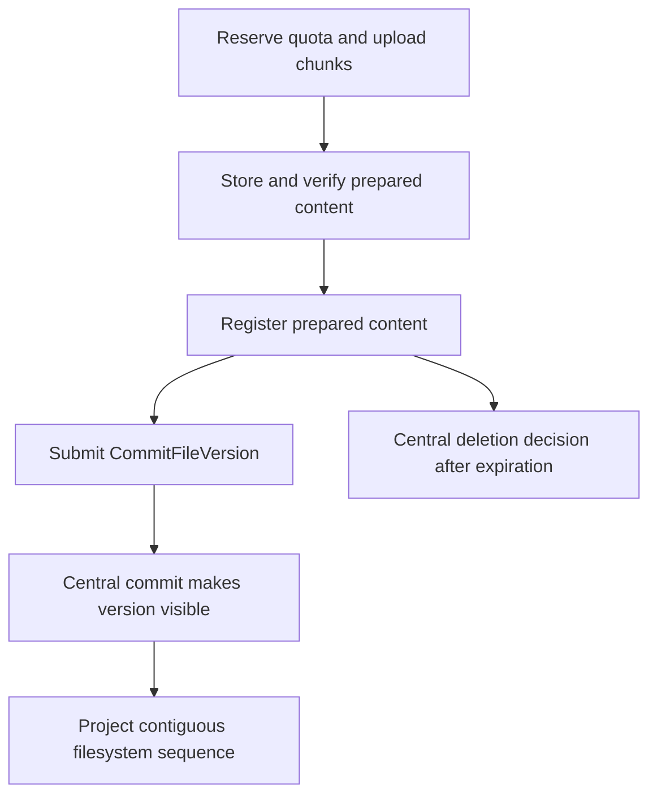

# 0007: Managed filesystems

| Field        | Value                         |
| ------------ | ----------------------------- |
| Status       | Draft                         |
| Scope        | Kernel, Extension, Experience |
| Created      | 2026-07-28                    |
| Last updated | 2026-07-28                    |

## Summary

Hyperkernel will expose managed logical filesystems without exposing the host
operating system's filesystem. Every filesystem is virtual relative to the
host. Its lifetime and content storage are independent choices:

- `persistent` and `session` define how long the filesystem is retained;
- `storageMode: "sqlar" | "object"` defines how file contents are stored; and
- an optional backup policy defines whether immutable snapshots are copied to a
  remote target.

The initial small-file mode will use one private SQLite database per logical
filesystem. It will retain the standard SQLar table for bounded content and add
versioned `hk_*` tables for stable entry identities, upload staging, hashes,
projection state, and recovery metadata. Logical paths, authorization,
lifecycle, and current content references remain Hyperkernel contracts rather
than SQLar semantics.

SQLar mode is intended primarily for text, source files, structured documents,
PDFs, images, and other bounded content. The implementation spike will evaluate
a range of logical per-file limits, including 16 MiB. Content above the selected
limit, or content that requires multipart upload and efficient byte ranges, uses
`object` mode. Hyperkernel will not silently move one file to another content
driver.

Agent sessions may receive isolated session filesystems with explicit
capabilities, quotas, and expiration. The same permission-checked operations
serve agents, applications, and the file-browser interface.

S3-compatible integration will initially provide one-way, immutable remote
backup and restore. It will not be described as bidirectional synchronization
until conflict, merge, deletion, and consistency semantics have a separate
design.

This record defines a target contract. Managed filesystems, SQLar storage,
object storage, and remote backup are not implemented or approved for support.

## Problem

Hyperkernel applications and agents need a place to create and exchange files.
Likely content includes source and configuration text, generated documents,
PDFs, images, exports, and occasional small media files. Agent work especially
benefits from a filesystem-shaped workspace that can be created for one
session, inspected by an authorized person, retained when useful, and removed
when it expires.

Giving applications or agents direct Node.js filesystem access would also give
untrusted names and operations a path toward host files, application secrets,
deployment artifacts, devices, sockets, symlinks, and other operating-system
resources. A chroot-like path check inside application code is not a sufficient
security boundary.

SQLar is attractive because its core format is a small ordinary SQLite schema:

```sql
CREATE TABLE sqlar(
  name  TEXT PRIMARY KEY,
  mode  INT,
  mtime INT,
  sz    INT,
  data  BLOB
);
```

The format is easy to inspect, copy, back up, and export. It also supports
per-file compression while remaining a valid SQLite database. However, SQLar
does not define stable entry identities, actor capabilities, workspace
isolation, quotas, optimistic concurrency, upload staging, trash, retention,
content history, remote backup, or safe path handling. It is a container
format, not a sandbox or complete filesystem service.

SQLar also uses whole-value compression semantics. Large or range-oriented
content would create unnecessary memory, write-amplification, backup, and media
seeking costs even though SQLite's theoretical BLOB and database limits are
much larger.

Hyperkernel therefore needs one stable filesystem contract with explicit
lifetime, storage, authorization, recovery, and portability boundaries.

## Invariants

1. A user-controlled value never becomes an operating-system path.
2. The browser, applications, and agents never receive an absolute host path,
   database path, raw SQLite connection, or storage credential.
3. Every operation authenticates the actor and checks a capability scoped to
   the workspace and filesystem before reading or changing state.
4. Humans, applications, and agents use the same filesystem command and query
   contracts.
5. Durable namespace and lifecycle changes enter through commands and immutable
   events. No interface writes authoritative filesystem metadata directly.
6. File bodies and remote credentials are not embedded in immutable command or
   event payloads. Events contain bounded references and integrity metadata.
7. A committed file version references content that was already stored
   durably and verified.
8. The central event transaction is the visibility and linearization point for
   every namespace mutation.
9. Namespace events have a contiguous per-filesystem sequence. Any
   storage-local namespace projection applies them in order and never skips a
   sequence.
10. Prepared content is invisible until its commit command succeeds. Rejected or
    abandoned uploads cannot appear in the namespace.
11. Prepared-content commit and cleanup compete through central registry state.
    A local expiration decision alone cannot delete finalized content.
12. File content is addressed by an opaque identity and verified digest.
    Filenames do not determine storage locations or object keys.
13. The logical hierarchy contains only regular files and directories.
    Symlinks, hard links, devices, sockets, and other special entries are not
    supported.
14. `.` and `..` are never entries. Absolute paths, empty segments, NUL,
    separators inside a name, and names outside configured limits are rejected.
15. Quotas cover committed content, prepared content, entries, concurrent
    uploads, and relevant stored overhead so staging cannot bypass a quota.
16. A storage-mode limit is enforced before allocation and again when content
    is finalized. Oversized content is never silently redirected.
17. Namespace mutations use stable entry identities and explicit concurrency
    expectations. A path is a derived presentation, not durable identity.
18. A backup is not current until every referenced object and checksum is
    durable and its manifest is published.
19. Restored content remains unavailable until its manifest, schema,
    references, sizes, and digests have been verified.
20. Deletion revokes access before asynchronous physical cleanup. Cleanup
    failure never restores access implicitly.
21. Import, export, backup, restore, and garbage collection are bounded,
    authorized, observable, retryable operations.

## Decision

### Model lifetime, storage, and backup independently

The filesystem contract uses three independent dimensions:

| Dimension     | Initial values            | Meaning                                                  |
| ------------- | ------------------------- | -------------------------------------------------------- |
| `lifetime`    | `persistent`, `session`   | Retention and expiration policy                          |
| `storageMode` | `"sqlar"`, `"object"`     | Selects the authoritative content driver                 |
| `backup`      | disabled or target policy | Optional remote snapshot schedule, retention, and status |

Every Hyperkernel filesystem is virtual because its namespace is implemented
through kernel APIs and never mounted from an actor-controlled host path.
`persistent` is used instead of `permanent`: a user may still delete the
filesystem, retention policy may remove content, and durability depends on
tested backup and restore.

Lifetime controls retention, not local commit durability or disaster recovery.
`persistent` means the filesystem has no automatic session expiration. A
content driver defines commit durability, while backup separately defines
disaster recovery.

Committed session content is crash-durable in its selected content driver until
expiration, but it has an owning session, an explicit expiration instant, and
no default disaster-recovery backup. It has no durability promise after
expiration. An authorized command may promote it to `persistent` before
expiration after checking persistent quotas and policy.

Storage mode does not follow lifetime. A persistent filesystem may use SQLar
or object storage, and a session filesystem may use either mode when policy
permits it.

### Separate the control plane from content stores

The kernel's central SQLite database is the control plane. Its commands, events,
and projections contain:

- filesystem identity, workspace, owner, lifetime, status, and storage mode;
- session identity and expiration where applicable;
- stable entry identities, parent relationships, names, and entry versions;
- current content identity, logical size, digest, and untrusted media type;
- contiguous filesystem sequence and prepared-content registry state;
- capabilities, quotas, retention, and backup policy references; and
- storage, projection, cleanup, and backup status.

Each SQLar filesystem has one private SQLite database in a storage-service
directory. The host filename is derived only from a kernel-generated opaque
filesystem identity. The storage service runs under a distinct unprivileged OS
identity inside a mount namespace or container that exposes only its dedicated
data volume. It has no access to the kernel database, application source,
deployment secrets, or unrelated host paths. It reports prepared content
through the capability-checked kernel API.

This boundary isolates remote actors, applications, and agents that receive
only managed filesystem capabilities. It does not sandbox arbitrary JavaScript
or native code already executing inside the Hyperkernel process under
Hyperkernel's OS authority. Untrusted generated code requires a separate code
execution sandbox and cannot be made safe by this filesystem API alone.

The control plane maintains the catalog used to browse all filesystems. It does
not attach every archive database. A bounded archive pool opens one database on
demand and closes idle handles. This avoids SQLite's attachment limits and
prevents the management interface from coupling its cost to every filesystem's
contents.

The separation has an explicit authority boundary:

- immutable events are authoritative for lifecycle, namespace, metadata, and
  references to content;
- the content store is authoritative for the opaque bytes identified by those
  references; and
- archive-local `hk_*` namespace tables are projections and recovery metadata,
  not an independent write path.

This is a proposed amendment to the current statement in
[0002](0002-event-sourced-persistence-with-sqlite.md) and `AGENTS.md` that the
event log alone is the source of truth for all durable domain state. File bytes
are user-visible durable state, but embedding them in the immutable log is
rejected below. Under this proposal, the event log remains the sole logical
authority for whether a content identity belongs to a filesystem and which
version is current. The complete durable content record is the combination of
an immutable event reference and its immutable content-store object. The
content store is not a second mutable namespace or business model.

Replay can rebuild namespace state and archive-local projections. Head-state
replay is complete only while every content object referenced by the replayed
head exists and passes integrity verification. Replay cannot recreate bytes
that were intentionally kept outside the event log and later erased. Backup,
retention, and integrity checks must therefore cover the event log and every
referenced content store.

Adopting this record requires a corresponding canonical architecture change
that amends or supersedes the conflicting invariant and names and constrains
external immutable content. This Draft cannot silently override `README.md`,
`AGENTS.md`, or 0002.

Historical events may continue to identify a content version after policy has
permitted its bytes to be erased. Historical inspection must then report the
version metadata and explicit content-unavailable state. It must not claim that
time travel can reproduce erased bytes. Before a content row is removed,
garbage collection proves that no current entry, retained-version policy,
active export or restore, or backup operation still requires it.

### Use a SQLar-compatible archive for bounded content

Every SQLar-mode database retains the standard `sqlar` table without changing
its column meanings. Hyperkernel adds versioned tables under the reserved
`hk_*` prefix. The initial logical roles are:

| Table or group     | Role                                                                   |
| ------------------ | ---------------------------------------------------------------------- |
| `sqlar`            | Finalized immutable bodies, whether prepared or referenced             |
| `hk_archive`       | Filesystem identity, schema version, and applied filesystem sequence   |
| `hk_entries`       | Rebuildable current namespace projection with stable entry IDs         |
| `hk_content`       | IDs, logical hashes, sizes, reachability, and validated codec metadata |
| `hk_uploads`       | Bounded prepared-upload state                                          |
| `hk_upload_chunks` | Bounded chunks not yet exposed as finalized content                    |

The exact physical schema requires a spike and a later migration plan. The
semantic separation is part of this decision.

Runtime `sqlar.name` values are reserved opaque content names, not
user-controlled logical paths. SQLar rows represent regular file content only.
Each opaque value is still a valid relative pathname for an internal content
object, such as `objects/<content-id>`; it is not presented as the logical path
of the user's file.
This keeps rename and move operations out of the content store and allows
multiple namespace versions to reference one immutable body. It also means the
private runtime database is not the user-facing export artifact.

The runtime `sqlar` table is the authoritative immutable byte-object store.
`hk_entries` is a rebuildable namespace projection. A SQLar archive whose names
are the user's current logical paths is an export or sanitized snapshot format,
not runtime namespace authority.

The runtime database is therefore a Hyperkernel-native SQLite content store
using SQLar-compatible row encoding. Only exported logical-path archives are
standard user-facing SQLar filesystems.

`ExportFilesystem` creates a new pure SQLar archive with the current logical
paths, file and directory rows, normalized modes, and no `hk_*` tables unless a
Hyperkernel-native export was explicitly requested. `ImportFilesystem` accepts
a standard SQLar archive as untrusted input and builds stable Hyperkernel entry
identities and content references.

SQLar fields retain their standard meaning:

- `mode` is a normalized regular-file mode and never authorizes access;
- `mtime` is the content object's kernel-recorded finalization time in epoch
  seconds and never establishes event order;
- `sz` is the uncompressed logical byte count; and
- `data` is either the original bytes or zlib-wrapped Deflate bytes when the
  compressed representation is smaller.

The logical entry modification time lives in the event-derived namespace and
`hk_entries`; export reconstructs it as the user-facing SQLar `mtime`.

The logical-content digest has the versioned shape
`{ algorithm: "sha256", value }` and is calculated over the uncompressed bytes.
The opaque content identity remains independent from this digest unless a
separate deduplication decision says otherwise. Remote transport checksums are
separate integrity evidence and cannot substitute for the logical-content
digest.

Already compressed content such as common image, video, and PDF encodings is
stored unchanged when Deflate does not reduce its size. SQLar-compatible
compression uses `node:zlib` inside the isolated storage worker; the initial
implementation does not enable a native SQLite extension. Synchronous
compression and `node:sqlite` work never runs on the main application event
loop.

A future codec cannot be added inside the standard `data` field without a
versioned format change because SQLar infers compression from
`length(data) < sz`. Any codec metadata in `hk_content` is derived from and
validated against that relation. It cannot declare an independent conflicting
codec.

### Bound SQLar mode by operational cost

The SQLar cutoff is an operating policy, not SQLite's format limit. It exists
because the initial Node.js path may materialize a complete value, SQLar
compression operates on the complete logical value, range access to compressed
data is inefficient, and large values increase backup and write-amplification
cost.

The implementation spike will sweep candidate logical per-file limits,
including 16 MiB, across compressible and incompressible content and
representative concurrent agent and UI workloads. It selects a default from
explicit budgets for peak worker RSS, global in-flight bytes, compression and
finalization latency, worker saturation, WAL and temporary-space amplification,
and backup and export duration. This record does not approve 16 MiB in advance.
The selected effective value is exposed by the filesystem capability query and
enforced before upload reservation and at finalization.

SQLar filesystems also have limits for:

- total logical bytes;
- total stored bytes;
- entry count and directory depth;
- active and prepared uploads;
- global and per-filesystem in-flight bytes;
- upload byte count, chunk count, and expiration; and
- decompressed size and compression ratio during import.

Prepared bytes count against quota. A tested `PRAGMA max_page_count` ceiling
provides defense in depth but does not replace logical quotas. The design does
not assume that Node's supported `node:sqlite` API exposes SQLite's
connection-level `sqlite3_limit()` controls.

A small video may fit SQLar mode, but efficient seeking and byte-range delivery
are not guaranteed for compressed SQLar content. The UI should recommend object
mode when media playback or partial access is a primary requirement.

### Use object mode for large and range-oriented content

Object mode preserves the same filesystem, entry, capability, command, event,
and query contracts. Only the `contentDriver` implementation changes.

The `object` content driver must provide:

- chunked or multipart preparation without buffering the complete file;
- durable finalization to an opaque content identity;
- streaming logical-size and digest verification;
- conditional immutable creation and ambiguous-completion reconciliation;
- bounded reads and HTTP-style byte ranges;
- immutable content identities;
- idempotent existence and integrity checks;
- retention, multipart-abort, and orphan-cleanup hooks;
- tombstone or generation-conditional deletion; and
- snapshot, restore, and health evidence required by its deployment.

User names never become object keys. An object key is derived from a
kernel-generated filesystem and content identity. Untrusted media type remains
metadata and cannot select executable behavior or bypass content checks.

The first `object` content driver may use a dedicated local object volume or an
S3-compatible service. Choosing and supporting a specific authoritative driver
requires measured operating requirements and recovery tests. An S3-compatible
live object content driver is distinct from S3-compatible backup even when both
use the same protocol.

The public name is `object`, not `LiteFS`. LiteFS is already the name of
Fly.io's distributed SQLite replication system, and its semantics are unrelated
to large-file storage. Reusing the name would incorrectly imply replication or
compatibility.

No filesystem mixes SQLar and object content in the initial contract. A file
that exceeds a SQLar limit fails with an explicit supported error and a
recommendation to use an object filesystem. Silent per-file promotion would
make portability, quota, backup, availability, and failure behavior depend on
content size.

`CopyFilesystemToStorageMode` copies the current namespace at one exact
`fs_seq` into a new filesystem identity and verifies every reachable entry. The
copy command atomically records the selected sequence and pins every content
identity reachable there. It releases the pins only after destination
verification or explicit abandonment. The operation does not copy command
history, preserve the source identity, or follow writes committed to the source
after the selected sequence. Migration with concurrent writes and in-place
cutover is deferred.

### Keep the namespace independent of host path syntax

Entries use stable IDs. Mutations identify a parent or entry by ID and pass one
name segment rather than an arbitrary path string.

Names are normalized to Unicode NFC. Equality is case-sensitive after
normalization. A name must be non-empty and cannot contain `/`, `\`, NUL,
control characters, or the exact values `.` and `..`. Byte-length, hierarchy
depth, and sibling-count limits are configured and validated consistently.

The root has a stable identity and no user-controlled name. Each non-root entry
has exactly one parent. A directory cannot be moved beneath itself. Sibling
names are unique under the filesystem's normalized equality rule.

Import and convenience APIs may accept relative POSIX-style paths, but they
must parse them into segments and validate every segment before creating any
entry. No normalized logical value is ever joined to a host storage root.

Hyperkernel initially supports only:

- regular files;
- directories;
- create, read, list, move, rename, replace, and `RemoveEntry`; and
- explicit import, export, copy, and download.

`RemoveEntry` makes an entry absent from the current namespace. The initial
contract rejects a non-empty directory so it cannot orphan descendants or emit
an unbounded recursive change. A future bounded `RemoveTree` protocol may add
recursive removal. The initial contract does not promise a user-visible trash
or entry-restore state.

Symlinks from imported SQLar archives are rejected. Hard links, special files,
mounts, file locks, memory mapping, native executability, and POSIX permission
emulation are outside the initial contract.

### Commit content before publishing a file version

The kernel database and a per-filesystem archive are separate transaction
domains. Hyperkernel will not claim atomic cross-database commit. It uses a
recoverable ordered protocol:

`BeginFileUpload`, `RegisterPreparedContent`, `ExpireFileUpload`, and
`CommitFileVersion` are commands. Every accepted durable transition appends a
bounded event; reservation, central content-registry, and quota rows are
synchronous kernel projections updated in the same transaction. Raw chunks and
file bytes remain outside the event log.



1. `BeginFileUpload` authorizes the actor and durably reserves an upload slot
   and maximum logical bytes in the control plane under filesystem, per-file,
   total, concurrency, and expiration limits. The content service accepts data
   only with that opaque reservation identity.
2. The content service records bounded chunks under the reservation.
3. Finalization verifies that the actual logical size fits the reservation,
   calculates its digest, optionally compresses SQLar content, commits an
   immutable prepared content row, and returns a bounded prepared-content
   reference.
4. The storage boundary proves that the immutable row exists, and
   `RegisterPreparedContent` records the reference as `prepared` in the central
   content registry.
5. `CommitFileVersion` opens one central transaction and validates the prepared
   state, actor, filesystem, destination, actual quota use, expected entry
   version, and idempotency identity inside that transaction.
6. In the same transaction, the kernel conditionally changes the registry state
   from `prepared` to `referenced`, allocates the next contiguous
   per-filesystem sequence `fs_seq`, appends the event, updates the synchronous
   namespace and quota projections, and records archive projection work in an
   outbox. If the state transition loses a race, the complete transaction is
   rejected or retried without publishing a version.
7. The successful central transaction is the linearization and visibility
   point. It does not wait for or advance an archive-local checkpoint.
8. The archive projector applies only `fs_seq == applied_fs_seq + 1`. It updates
   `hk_entries`, content reachability, and `hk_archive.applied_fs_seq` in one
   archive transaction. Repeating an already applied sequence is idempotent;
   skipping a sequence is prohibited.

A crash after step 3 but before step 5 leaves invisible prepared content, which
must be reconciled against the central reservation and content registries. A
local expiration timer never deletes a finalized row by itself.

Commit and cleanup compete in the central database. `CommitFileVersion` may
change `prepared` to `referenced`; expiration may change `prepared` to
`delete_pending`. Exactly one transition commits. Only a central deletion
outbox authorizes physical removal. An unknown local orphan is reported and
cross-checked centrally before the outbox can delete it.

A crash after step 6 but before the client receives a response is resolved by
retrying the same command identity or querying its outcome. The referenced
content already exists. An abandoned reservation expires idempotently and
releases its upload slot and reserved quota only after its prepared-content
state has been reconciled.

Rename, move, metadata change, and `RemoveEntry` do not rewrite immutable
content. They append namespace events with contiguous `fs_seq` values.
Garbage collection may remove content only after the central registry proves
that no current entry, retained version, prepared restore, or retained backup
requires it and commits a deletion outbox entry carrying
`notReferencedAfterFsSeq`.

The SQLar archive worker waits until `applied_fs_seq` reaches that sequence,
rechecks local reachability, and removes the body and its metadata in one
archive transaction. An object content driver uses a tombstone or
generation-conditional deletion so a late multipart completion cannot recreate
content after the deletion decision.

### Separate namespace removal from physical purge

`RemoveEntry` removes an entry from the current namespace. It does not promise
immediate byte erasure, removal of retained versions, or deletion from completed
remote backups. The interface must use “Remove” for this operation and must not
describe it as “Purge.”

Before this record reaches Development, Hyperkernel must choose and document:

- whether filenames and other namespace metadata embedded in immutable events
  are explicitly non-erasable or use an erasable encryption or indirection
  boundary;
- local file-version retention duration;
- the authorization and evidence required for physical purge;
- backup retention and remote backup-side garbage collection; and
- the user-visible distinction between removal, retained recovery, and purge.

Active backup jobs pin local content only until their immutable remote snapshot
is complete or abandoned. A completed backup preserves its own remote copy and
does not indefinitely pin the local object. Remote retention removes an
immutable manifest and then garbage-collects remote objects only when no
retained manifest references them.

### Make session filesystems first-class but bounded

An agent session may request or be assigned one or more session filesystems.
Creation policy limits active filesystems, bytes, entries, uploads, and maximum
expiration per actor or session.

The session actor receives only its declared filesystem capabilities. Another
agent does not gain access merely because it runs in the same Hyperkernel
installation. An authorized person may inspect a session filesystem through
the same queries when policy grants that capability.

Session filesystems have these lifecycle rules:

- creation records an owning session and absolute expiration instant;
- session closure may request earlier expiration;
- actor-facing data and lifetime operations require `state = active` and a
  kernel-recorded current instant earlier than `expiresAt`;
- a system actor submits `ExpireFilesystem(expectedVersion)` for overdue
  filesystems at startup and periodically, so a delayed reaper cannot restore
  access;
- `ExpireFilesystem` requires `state = active` and a kernel-recorded current
  instant at or after `expiresAt`; authorized cleanup commands require
  `state = expired` or `state = deleting`;
- `PromoteFilesystem` and `ExpireFilesystem` check the same expected version and
  compete in one central transaction;
- upload finalization and `CommitFileVersion` recheck active state and
  expiration, and a read lease cannot extend beyond `expiresAt`;
- expiration records `active -> expired`, revokes capabilities, and makes the
  filesystem unavailable before `expired -> deleting -> deleted` cleanup;
- process or reaper failure does not extend expiration;
- cleanup is idempotent and reports pending or failed state;
- no remote backup is enabled by default; and
- `PromoteFilesystem` may remove the expiration and retain the same identity
  only after authorization and persistent-quota validation.

Promotion does not change storage mode. Changing storage mode remains a copy or
future migration operation.

### Expose one capability-scoped API

The public contract is filesystem-oriented and storage-mode-independent.
Candidate capabilities include:

- list filesystems visible to the actor;
- inspect filesystem metadata, usage, and health;
- read entries and content;
- create and update entries;
- manage lifetime, quotas, deletion, and restore;
- export or import;
- configure or run backup.

Every capability is scoped at least by workspace and filesystem. Future
subtree capabilities may scope access by stable entry ID, never by a
string-prefix path check. Mutations and consequential agent tool calls retain
actor, command, causation, and outcome audit data.

The API exposes derived logical paths, entry IDs, versions, sizes, hashes when
policy permits them, capability limits, and stable failure descriptors. It does
not expose storage database locations, S3 keys, presigned administrative
credentials, or raw SQL.

Read-only logs and other provider-backed system views are not user-owned
managed filesystems in this initial contract. A later record may expose them
through a separate read-only provider without granting access to internal
storage directories.

### Provide a filesystem management experience

The management interface queries the central filesystem catalog. It can:

- filter persistent and session filesystems;
- show owner or session, expiration, storage mode, usage, quota, health, and
  backup status;
- browse a logical tree and inspect stable metadata;
- preview supported content safely and download other content;
- create directories and upload, rename, move, copy, export, and remove entries;
- promote an authorized session filesystem;
- configure, run, inspect, and restore remote backups; and
- show explicit pending, rejected, failed, unavailable, and cleanup states.

The UI uses the same command and query contracts as applications and agents. It
does not open archive databases in the browser.

Untrusted active content is not rendered with application origin authority.
HTML and SVG are downloaded or rendered in an isolated preview boundary.
Responses use explicit content type, `nosniff`, safe content disposition, and
policy-controlled preview behavior. A claimed MIME type is never trusted as
validation.

### Treat S3-compatible integration as remote backup first

The initial remote contract is one-way backup and explicit restore, not
bidirectional synchronization.

For a SQLar filesystem, a backup worker:

1. receives an authorized durable backup request through an outbox;
2. records exact `targetFsSeq = N` and its corresponding
   `globalEventPosition = P`, and pins every content identity reachable at that
   sequence in the central registry;
3. reconstructs the namespace at exactly `N` from bounded filesystem events;
4. materializes a new sanitized SQLar snapshot containing that namespace and
   only the pinned referenced bodies, excluding uploads, prepared bodies,
   unreachable versions, and unrelated `hk_*` operational state;
5. verifies every logical size and digest, then computes a checksum over the
   completed snapshot and an immutable versioned manifest;
6. uploads the immutable snapshot and manifest to the configured S3-compatible
   target;
7. verifies a supported strong remote checksum or performs a complete read-back
   verification; and
8. records the immutable manifest identity as a completed backup only after
   every referenced object is complete.

A mutable `latest` pointer may be published as a convenience cache, but it is
not the correctness or restore authority. An S3 ETag is not accepted as a
content checksum because multipart upload and server-side encryption can change
its meaning.

The worker never copies a live runtime database file, exposes prepared state,
or separates a database from its WAL. The SQLite Online Backup API may be used
for a separate tested physical system backup, but it is not the filesystem
snapshot algorithm described here. Network calls never occur inside the
authoritative command transaction.

The manifest includes at least filesystem identity, storage mode, archive
schema version, `targetFsSeq`, corresponding `globalEventPosition`, logical and
stored byte counts, entry count, object checksums, and creation metadata.
Remote credentials are stored through a secret boundary; events and manifests
contain only a credential reference and safe endpoint identity.

Remote endpoints are operator-approved connector configurations, not arbitrary
URLs that an agent can cause the backup worker to request. Endpoint validation,
HTTPS and certificate verification, controlled network egress, and
least-privilege bucket credentials are required. Every DNS resolution and
redirect target is revalidated; loopback, link-local, instance-metadata,
private, and otherwise prohibited address ranges are blocked. A deployment
that intentionally needs a private endpoint requires a separate
administrator-approved network policy. These controls prevent server-side
request forgery and cross-filesystem object access.

An object-mode backup follows the same immutable-manifest publication rule.
Where the target supports compatible object semantics, it may copy only content
identities the target does not already contain, then publish a namespace
snapshot that references their verified digests. Driver-specific copying cannot
weaken the common rule that no manifest becomes current before all of its
content is readable and verified.

Backup failure does not roll back committed file changes. It advances an
observable failed or stale backup status and follows bounded retry policy.

Initial restore always creates a new filesystem in a hidden `provisioning`
state. It validates the immutable manifest and every referenced digest, emits
bounded import facts, rebuilds and verifies namespace projections, and becomes
visible only through one authorized activation event. It never overwrites or
cuts over an active filesystem.

A filesystem snapshot is sufficient to import the captured current state as a
new filesystem because it contains the exact materialized namespace at a
declared event position. It is not, by itself, a complete backup of the original
command and event history. In-place disaster recovery of an existing
installation requires a coordinated kernel-database backup plus every content
snapshot referenced at its recovery position. The system-level backup contract
must define that coordination separately. Its recoverable watermark is the
intersection of the central event-log coverage and verified content-snapshot
coverage, never either position alone.

Bidirectional synchronization is deferred because it requires identities and
rules for concurrent rename, replace, deletion, directory moves, conflict
presentation, offline edits, and remote trust. A later design may build those
semantics on immutable file versions; calling one-way backup “sync” would be
misleading.

### Define concurrency and idempotency explicitly

Namespace commands carry the expected filesystem or entry version needed for
their decision. Concurrent writes to the same entry cannot silently overwrite
one another. Directory uniqueness and cycle checks use a synchronous kernel
decision projection.

Upload identities are single-use and actor-bound. Chunk writes are idempotent
by upload ID and sequence with matching digest. Finalization is idempotent for
the same complete chunk set. A commit command retry uses the same command and
prepared-content identities.

Copy and import use explicit destination conflict policies rather than
last-writer-wins. Backup jobs use stable operation identities so a retry
continues or proves an existing remote object instead of recording duplicate
completion.

### Make failure and recovery states visible

The contract distinguishes:

- rejected operations, including authorization, quota, invalid name,
  unsupported entry, conflict, and SQLar size-limit failures;
- prepared orphan content awaiting cleanup;
- committed metadata whose content store is temporarily unavailable;
- archive projection lag or failure;
- archive corruption or failed integrity verification;
- `object` content-driver unavailability;
- backup pending, stale, failed, or unconfirmed outcome;
- deletion pending or failed cleanup; and
- restore validation or candidate-activation failure.

The kernel never substitutes empty content, skips an event, guesses a path, or
marks a backup current after an ambiguous remote outcome.

SQLar integrity checks, content digests, representative reads, backup restore
tests, and explicit archive schema migrations form the recovery evidence.
Corrupt content is quarantined and restored from a verified snapshot when one
exists. If no verified copy exists, the file remains explicitly unavailable.

### Keep import and export safe

Import always targets a new hidden filesystem in `provisioning` state. The
worker emits bounded per-entry or bounded-batch facts as it builds the
candidate, verifies its projections, and makes the complete filesystem visible
through one activation event. A failed candidate remains hidden and is cleaned
up through the normal deletion protocol. Atomic import into an active
filesystem is deferred.

An uploaded SQLite database is hostile input. A resource-limited isolated
worker opens it read-only, disables extension loading, disables trusted schema
behavior and enables defensive mode where the supported SQLite API permits,
uses fixed parameterized queries, and never executes archive-defined triggers,
views, or application SQL. It validates the exact ordinary `sqlar` table shape
and rebuilds accepted content into a fresh Hyperkernel database rather than
adopting the uploaded database as runtime storage.

Validation covers row count, total and per-file logical sizes, compressed
sizes, exact bounded decompression output, compression ratio, path
normalization, depth, duplicate normalized paths, digest calculation, and
available quota. Standard SQLar representations are interpreted explicitly:

- a directory has `sz = 0` and `data IS NULL`;
- an empty regular file has `sz = 0` and non-null zero-length `data`;
- a symlink has `sz = -1` and is rejected; and
- every other special mode is rejected.

Hyperkernel never extracts an imported archive onto the host filesystem.

Exports operate at a stable namespace version. They either complete as one
verified archive or fail without publishing a partial result. Exported paths
are derived from validated logical segments and are used only as SQLar archive
names.

SQLar mode exports a pure logical-path SQLar archive. Object mode initially
exports an object-native package containing an immutable namespace manifest and
the referenced immutable objects, preserving streaming and range-oriented
content. Converting an object filesystem to one SQLar archive is unsupported
until separate per-file and total export limits and a bounded streaming
implementation are approved.

## Considered solutions

### Give agents restricted Node.js filesystem access

A dedicated host directory plus path checks would be simple and provide native
streaming.

This solution is rejected as the public boundary. Path traversal, symlinks,
hard links, special files, race conditions, process credentials, and accidental
host-path exposure create a much larger security contract. An internal object
driver may use opaque files inside an isolated volume, but actors still use the
managed API.

### Use unextended SQLar as the complete domain model

One row per path is compact and immediately extractable.

This solution is rejected because a mutable path cannot provide stable entry
identity, subtree-safe capabilities, optimistic concurrency, upload staging,
content-version references, retention, or lifecycle state. Directory rename
also rewrites every descendant name. The standard table remains the bounded
content container and export format.

### Use a custom runtime BLOB table and SQLar only for interchange

A table such as `hk_content_blobs` could store opaque content with explicit
codec, format-version, and integrity columns. Import and export would translate
between that table and pure SQLar archives.

This solution gains clearer runtime semantics and freedom to add codecs without
appearing SQLar-compatible. It loses stock SQLar inspection and standard
per-row encoding for the internal byte objects. The selected Draft instead uses
an internal SQLar object namespace plus `hk_*` metadata because its encoding is
small and inspectable, while explicitly conceding that logical-filesystem
portability still requires export. The implementation spike must compare both
schemas before this choice advances to Development.

### Store file bodies in immutable events

Embedding bytes in each event would let event replay reconstruct content
without another authority.

This solution is rejected because large immutable payloads would make the
event log, projections, upgrades, replication, retention, privacy, and backup
cost scale with every file version. File bodies and secrets require explicit
indirection.

### Put every logical filesystem in one SQLite database

One database could make metadata and content changes share a transaction and
reduce file-handle management.

This solution is rejected for the initial filesystem boundary because it
couples quota exhaustion, corruption, write contention, backup, restore,
export, expiration, and deletion across unrelated filesystems. One archive per
filesystem gives clearer isolation and portability at the cost of a catalog and
bounded handle pool.

### Commit through an attached archive database

SQLite can make a transaction across attached database files crash-atomic only
when the main database is on disk and the transaction does not use WAL
journaling. Hyperkernel could attach one archive during a command and update
the event log and archive together.

This solution is rejected because it would give up the central WAL operating
model, couple every command to archive-file availability on the same host, and
expand lock and recovery behavior across databases. It would still not make
overwritten bytes replayable unless immutable content versions were retained.

### Mutate the visible SQLar namespace before appending the event

Writing a normal path row first and appending the central event afterward would
make the archive immediately extractable.

This solution is rejected because a crash or rejected command can leave visible
unlogged namespace state. Reversing the order can leave an event that depends
on content not yet durable. The selected protocol writes only invisible
immutable content first, makes the central event transaction the linearization
point, and updates archive projections later through an idempotent contiguous
sequence.

### Create one operating-system directory per filesystem

Native directories provide efficient large-file access and familiar tooling.

This solution is rejected as the SQLar mode because it loses the single
portable archive and creates a larger host security and backup surface. The
object content driver may use an internal opaque directory as an implementation
detail without exposing directory semantics.

### Select a content driver automatically for each file

Automatic promotion based on size or MIME type would make uploads appear
convenient.

This solution is rejected initially because one filesystem would gain mixed
availability, backup, range, export, and recovery semantics. MIME types are
also untrusted, and a changing threshold could move otherwise identical
content to different authorities.

### Use S3 as the default live SQLar storage

Uploading the SQLite file after each change or placing it on a network
filesystem would centralize remote durability.

This solution is rejected. SQLite requires reliable local filesystem locking,
and copying a live database or its WAL unsafely can produce an inconsistent
backup. SQLar remains local; immutable snapshots are uploaded. A separate
object content driver may use S3-compatible object semantics directly.

### Provide bidirectional S3 synchronization

Two-way synchronization would let multiple installations edit the same
filesystem.

This solution is deferred. Object APIs do not define filesystem conflict
semantics, and mutable SQLite databases have no native merge protocol. The
first remote contract is deterministic backup and restore.

### Name the large-file mode Hyperkernel LiteFS

The name would contrast a lightweight SQLar mode with a larger-file mode.

This solution is rejected because LiteFS is an existing distributed SQLite
replication product and “Lite” does not describe large or range-oriented
content. The contract uses the explicit names `sqlar` and `object`.

## Consequences

### Gains

- Applications and agents receive useful filesystem semantics without host
  filesystem authority.
- SQLar preserves a small, inspectable, SQLite-based content format for common
  bounded files.
- Stable entry and content identities avoid making mutable paths authoritative.
- Persistent and session lifetimes reuse one API and differ only in retention
  policy.
- Agent workspaces are isolated, inspectable, quota-controlled, and optionally
  persistable.
- Object mode can add streaming and range access without changing namespace or
  capability contracts.
- One-way immutable backups have deterministic completion and restore
  semantics.
- One database per filesystem isolates archive-local contention, cleanup,
  backup, and corruption boundaries.

### Costs and limitations

- SQLar alone is not sufficient; Hyperkernel must maintain a catalog,
  versioned metadata tables, an upload protocol, content integrity, and garbage
  collection.
- Separate kernel and content databases require a prepared-content protocol
  instead of one atomic transaction.
- One database per filesystem requires a bounded connection pool, migration
  orchestration, integrity monitoring, and many-file backup handling.
- It does not isolate central control-plane failure, storage-service failure, or
  exhaustion of a shared underlying volume.
- The event log cannot reconstruct file bytes without the corresponding
  content store and backup.
- SQLar mode does not provide efficient seeking for compressed media and has a
  conservative per-file operating limit.
- A runtime SQLar database uses opaque content names. A user-facing portable
  archive is produced through explicit export.
- Filesystems that mix content drivers, transparent in-place storage-mode
  migration, native mounts, POSIX compatibility, file locks, and bidirectional
  sync are not initially supported.

### Maintenance cost

Maintainers must preserve archive schema readers and migrations, test SQLite
and compression behavior across supported upgrades, retain digest and manifest
compatibility, and keep content-driver behavior equivalent at the public API.
Quotas, error descriptors, capability scopes, import validation, preview
isolation, and garbage-collection proofs become long-lived security contracts.

Every supported object content driver and S3-compatible target adds a recovery
and compatibility test matrix. A protocol-compatible endpoint is not
automatically operationally equivalent in multipart behavior, checksum
evidence, consistency, or error reporting.

### Operational complexity

Operators must monitor storage bytes, prepared orphan bytes, archive integrity,
connection-pool pressure, projection lag, cleanup failures, backup age, restore
evidence, and `object` content-driver availability. Persistent support requires
tested backup, restore, migration, corruption, disk-full, and interruption
recovery procedures.

Session filesystems reduce long-term storage only when expiration and cleanup
continue reliably after process and agent failure. Their quotas and cleanup
backlog require explicit admission control.

### Scaling implications

Separate archive databases distribute SQLite's single-writer constraint across
content preparation and archive projection, but every visible namespace
mutation still serializes through the central event-log writer. Each SQLar
filesystem also has one archive writer at a time. A hot shared filesystem may
therefore need short transactions, admission limits, or object mode; it is not
solved by creating more application processes.

Catalog listing scales with filesystem metadata rather than archive attachment.
Content reads and backups scale independently per archive, subject to bounded
global concurrency. Large-file throughput scales through object storage rather
than increasing SQLar limits.

Garbage collection and retained versions can dominate storage over time.
Reachability, retention, backup pins, and deletion must be indexable and
processed incrementally rather than scanning every archive in one operation.

## Decision boundary

This record defines the logical filesystem, independent lifetime and storage
axes, SQLar and object responsibilities, content commit protocol, capability
boundary, session lifecycle, and initial remote-backup semantics.

It does not freeze:

- the final SQLar per-file or total default quotas;
- the physical `hk_*` table definitions;
- a specific object content driver or S3-compatible provider;
- the filesystem browser's visual layout;
- preview support for particular media formats;
- retained file-version duration;
- encryption-at-rest or deduplication policy;
- read-only system views and provider-backed filesystems for logs or diagnostics;
- in-place storage-mode migration and cutover;
- a native mount, WebDAV, or FUSE adapter; or
- bidirectional synchronization and merge behavior.

A material change that exposes host paths, makes filenames storage keys, writes
file bodies into immutable events, permits symlinks or special files, silently
mixes content drivers, or publishes mutable remote state as current without a
verified manifest requires a new design record after this record becomes
Stable.

## Open questions

- What measured per-file, total-byte, entry, chunk, and concurrent-upload limits
  satisfy representative Node.js 24 workloads?
- Should SQLar content deduplicate identical logical bytes within one
  filesystem, and which side-channel or garbage-collection costs follow?
- Which file-version retention policy balances time travel, user recovery,
  privacy, and storage growth?
- How should erasable filenames and other sensitive namespace metadata be
  represented while preserving immutable event history?
- Which `object` content driver should be implemented first, and what local-only
  deployment remains simple enough for self-hosting?
- Which preview formats can be isolated safely on the supported web origin and
  browser matrix?
- What evidence should allow an S3-compatible endpoint to be declared supported
  for backup or authoritative object storage?

## Evaluation

This record may advance to Development when:

- the independent lifetime, storage, and backup dimensions are approved;
- the canonical event-source invariant is amended or superseded to define the
  event-reference plus immutable-content authority boundary;
- the prepared-content commit and orphan-recovery protocol is accepted;
- filename erasure or documented non-erasability, retained-version duration,
  physical purge, backup retention, and remote garbage-collection policies are
  approved;
- the internal SQLar object namespace is selected over a custom runtime BLOB
  table using spike evidence;
- the SQLar interoperability boundary and `sqlar` versus `object` names are
  accepted;
- the Kernel portions receive review and approval from an experienced human
  maintainer; and
- an implementation scope chooses measured initial quotas and one concrete
  agent-session workflow.

It may advance to Evaluation when the repository contains:

- a versioned per-filesystem archive schema with exact SQLar compatibility
  tests;
- a central filesystem catalog and bounded on-demand archive pool;
- capability tests proving workspace and filesystem isolation for humans,
  applications, and agents;
- hostile name, traversal, symlink, special-entry, decompression, and quota
  tests, plus non-empty-directory `RemoveEntry` rejection;
- hostile SQLite import tests proving read-only isolation, disabled extension
  loading and trusted schema behavior, bounded resource use, and reconstruction
  into a fresh database;
- chunked upload, finalization, command retry, conflict, orphan cleanup, and
  disk-full tests;
- crash-window tests before prepared-content commit, before event commit, after
  event commit, and before the client response;
- cleanup-race tests proving that central `prepared`, `referenced`, and
  `delete_pending` transitions and `notReferencedAfterFsSeq` prevent deletion
  of committed or not-yet-projected content;
- namespace incremental-versus-clean-replay equivalence tests;
- archive projection rebuild, contiguous `fs_seq`, idempotency, and corruption
  tests;
- exact-sequence storage-mode copy tests covering source-content pins,
  completion, abandonment, and concurrent source writes;
- standard SQLar import and export round trips;
- one concrete `object` content driver with tests for ambiguous multipart
  completion, abort and orphan cleanup, conditional immutable creation,
  streaming digest verification, byte-range correctness, retention,
  generation-conditional deletion, authoritative-store outage, and independent
  export, backup, and restore;
- session creation, crash recovery, overdue-startup expiration, delayed reaper,
  promotion-versus-expiration, in-flight read and upload expiration, cleanup
  failure, and persistent-quota validation tests;
- safe preview and download tests for representative untrusted content;
- one exact-sequence sanitized remote snapshot and verified new-filesystem
  restore through an S3-compatible target;
- endpoint tests covering DNS changes, redirects, prohibited address ranges,
  TLS failure, credential scope, and administrator-approved private endpoints;
- proof that a failed or ambiguous backup cannot record an immutable manifest
  as completed, and that ETag is not treated as a strong checksum; and
- representative benchmarks that establish SQLar limits and demonstrate why
  larger or range-oriented files use object mode.

It may advance to Stable only after supported upgrades preserve archive,
manifest, event-reference, and digest compatibility; persistent and session
filesystems have run under representative agent and user workloads; backup and
restore drills meet defined recovery objectives; and security review covers
storage isolation, import, preview, credentials, quotas, cleanup, and content
retention.

## References

- [Hyperkernel public architecture](../../README.md)
- [Hyperkernel engineering contracts](../../AGENTS.md)
- [0002: Event-sourced persistence with SQLite](0002-event-sourced-persistence-with-sqlite.md)
- [0004: Interface design philosophy](0004-interface-design-philosophy.md)
- [0005: Agent-generated application specifications](0005-agent-generated-application-specifications.md)
- [0006: Error handling and recovery](0006-error-handling-and-recovery.md)
- [SQLite Archive Files](https://sqlite.org/sqlar.html)
- [SQLar format and reference implementation](https://sqlite.org/sqlar/doc/trunk/README.md)
- [SQLite limits](https://sqlite.org/limits.html)
- [SQLite ATTACH DATABASE](https://sqlite.org/lang_attach.html)
- [SQLite Online Backup API](https://sqlite.org/backup.html)
- [SQLite write-ahead logging](https://sqlite.org/wal.html)
- [Appropriate uses for SQLite](https://sqlite.org/whentouse.html)
- [Node.js SQLite](https://nodejs.org/api/sqlite.html)
- [Node.js zlib](https://nodejs.org/api/zlib.html)
- [LiteFS documentation](https://fly.io/docs/litefs/)

## Status history

| Date       | Status | Reason                                                   |
| ---------- | ------ | -------------------------------------------------------- |
| 2026-07-28 | Draft  | Initial managed-filesystem contract proposed for review. |
