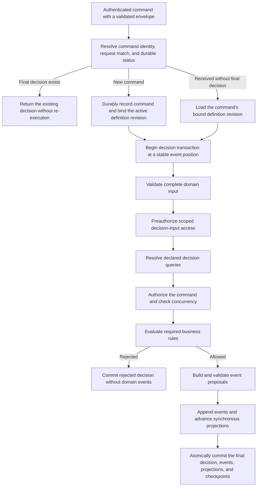

# 0009: Explicit business rules

| Field        | Value             |
| ------------ | ----------------- |
| Status       | Draft             |
| Scope        | Kernel, Extension |
| Created      | 2026-08-02        |
| Last updated | 2026-08-02        |

## Summary

Hyperkernel will explore first-class, reusable business-rule definitions as an
explicit boundary between command composition and domain decisions. The
current API hypothesis calls these definitions `invariant`, but that vocabulary
is provisional. A command handler declares the rules required to accept a
command and the events it may raise. The kernel evaluates those rules against
declared, typed decision queries before it permits the handler to propose
events.

The initial direction is a code-first API made of inspectable descriptors. Its
purpose is not merely to move callback code into another function. Each
descriptor must give the kernel useful structure: stable identity and version,
typed input, declared query dependencies, a bounded evaluation contract, and a
typed allow-or-reject result. That structure may later support inspection,
reuse, static analysis, visual tooling, and application definitions proposed by
developers or AI agents.

Only decision queries backed by transactionally current decision projections
may participate. A normal read query or an asynchronously advanced extension
projection may be stale and cannot become authoritative merely because a
business rule references it.

This record refines the command rules and decision inputs explored by
[0005: Agent-generated application specifications](0005-agent-generated-application-specifications.md).
It does not approve database-stored JavaScript, in-place editing of executable
domain rules, or a specific public TypeScript API. Nothing described here is
implemented or approved for support.

## Problem

The conceptual command API currently places the complete domain decision in a
command handler:

```ts
const myCommand = command({
  type: "MyCommand",
  input: MyCommandInput,
  handler(context, input) {
    if (!context.foo) {
      throw new Error();
    }

    return raise(MyEvent(input));
  },
});
```

This control flow is locally readable, but it makes a handler responsible for
several distinct concerns:

- choosing which domain facts it needs to read;
- enforcing the rules that permit or reject the requested change;
- translating accepted intent into event facts; and
- expressing an expected domain rejection or an unexpected failure.

As the application grows, rules embedded in handlers are difficult to list,
reuse, compare, version, audit, or expose safely to tooling. Two commands may
implement the same rule differently. A developer or AI agent must inspect
arbitrary code to learn which rules protect an event. The kernel cannot verify
declared dependencies or explain a rejection if the relevant structure exists
only in callback control flow.

Extracting a callback into an `invariant()` wrapper does not by itself solve
this problem. The additional ceremony is justified only when it creates an
enforceable and inspectable contract.

The desired common path is that a command author primarily answers two domain
questions:

1. Which named business rules must hold for this command to be accepted?
2. Which versioned event facts does the accepted command raise?

This is a composition target, not a claim that every domain decision can be
reduced to a static list. Some decisions may still need a named, typed,
versioned custom decider. That escape path must remain explicit and constrained
instead of leaking arbitrary behavior into otherwise declarative definitions.

## Terminology and boundaries

### Semantic goal

The concept this record needs to expose is a **business rule**: a named domain
statement that participates in deciding whether a command may become accepted
facts. The initial `invariant()` syntax is one candidate expression of that
concept, not yet its accepted public name.

The example `EmailMustBeAvailable` evaluates validated command input against a
consistent decision snapshot and produces an expected allow-or-reject result.
It is a precondition for `CreateUser`. The enduring domain property it helps
protect is different: no two users may have the same email address.

This distinction matters because public descriptors cross files, applications,
audit history, generated definitions, and time. Their names must describe the
semantic contract, not merely the control-flow mechanism used to execute them.

### Candidate vocabulary

| Term        | Semantic promise                                                                 | Best fit in this design                                                        | Main risk as the primitive name                                                                                              |
| ----------- | -------------------------------------------------------------------------------- | ------------------------------------------------------------------------------ | ---------------------------------------------------------------------------------------------------------------------------- |
| `Guard`     | A check placed at an entry or control-flow boundary to prevent invalid progress. | A local callback or implementation mechanism that protects a command stage.    | In TypeScript it also suggests type narrowing; it says how control is stopped, not which domain rule exists.                 |
| `Invariant` | A property that remains true for every valid domain state or transition.         | Naming the enduring property a command and its events must preserve.           | `EmailMustBeAvailable` is true before creation and false afterward, so treating it as an invariant overstates its semantics. |
| `Gate`      | An admission stage that opens or closes after evaluating one or more conditions. | Naming the Kernel stage that aggregates authorization, concurrency, and rules. | It is orchestration vocabulary, not the business statement being inspected, reused, or versioned.                            |
| `Rule`      | A domain statement used to decide whether an operation is allowed.               | The umbrella for reusable business checks such as `EmailMustBeAvailable`.      | It is broad and should be qualified as `domain rule` or `business rule` when it crosses module boundaries.                   |
| `Policy`    | A contextual or configurable strategy for choosing an allowed outcome.           | Tenant-aware choices, authorization policy, or composition of several rules.   | It implies configurability and overlaps the existing authorization vocabulary; many domain rules are not policies.           |

The same email decision can therefore be described at several distinct levels:

- **Invariant:** user email addresses are unique in every accepted state.
- **Rule or precondition:** the requested email must be available before
  `CreateUser` may be accepted.
- **Guard or check:** the function evaluates the materialized context and
  returns `allow()` or `reject()`.
- **Gate:** the Kernel does not call `raise` until all required checks allow the
  command.
- **Policy:** an application could separately define whether and when a
  previously released email may be reused.

These terms are complementary when each owns one level. They become ambiguous
when used as interchangeable names for the same descriptor.

### Working recommendation

Use **business rule** or **domain rule** as the architectural umbrella. Use
`Rule` as the current candidate for a stable, reusable descriptor because it
accurately covers command preconditions without claiming that the checked
expression remains true after the command. In a domain-specific module, the
short factory may be `rule()`; across public or persisted boundaries, metadata
and documentation should retain the `domain rule` qualification.

Reserve the other terms for their narrower meanings:

- `invariant` names the enduring property protected by one or more rules and
  event transitions;
- `check` names the deterministic callback returning `allow()` or `reject()`;
- `guard` remains an implementation-level synonym only when its TypeScript
  type-guard meaning cannot be confused;
- `gate` names an execution stage, not a domain definition; and
- `policy` names contextual or configurable choice, including authorization
  policy, rather than every business rejection.

Under this recommendation, the illustrative API could eventually rename
`invariant(...)` to `rule(...)` and `invariants: [...]` to `rules: [...]`
without changing the proposed execution contract. The example retains the
user-proposed `invariant` vocabulary while the record is Draft so the semantic
decision remains visible rather than being hidden by an early mechanical
rename. Subsequent prose uses **business rule** for the domain concept and uses
`invariant` only when discussing the provisional API spelling.

The naming invariant is: **name the reusable object for the domain statement it
represents, and name the callback or stage for how that statement is
evaluated**. Continue with `Rule` unless representative command examples show
that the descriptors consistently encode enduring state invariants or
configurable policies instead of preconditions. Do not reopen the choice for
cosmetic preference alone.

### Contract boundaries

A pre-append business-rule check does not by itself prove that the emitted
events preserve a post-commit invariant. Before this record advances to
Development, the chosen public term and its relationship to protected domain
invariants must be approved.

The following remain separate contracts even if their declarations later use
similar machinery:

- Zod validation of an untrusted command envelope and complete domain input;
- actor authentication and authorization;
- idempotency and optimistic concurrency;
- business-rule evaluation;
- event proposal and payload validation; and
- projection execution and checkpointing.

A business rule cannot grant a capability or replace authorization. It cannot
turn an eventually consistent read model into authoritative decision state. It
cannot write a projection, append an event, dispatch another command, or
perform an external effect.

The `invariant`, `use`, decision-query, execution, version-binding, and audit
contracts are Kernel changes. The intended architecture treats individual
domain queries, rules, commands, and events as Extension definitions interpreted
through constrained Kernel contracts. There is an unresolved classification
boundary: JavaScript callbacks for query argument binding, rule evaluation, or
event construction that run while the authoritative write transaction is open
participate in that transaction and are therefore Kernel changes under the
current engineering rules. The code-first experiment cannot claim the lower
Extension review boundary unless it establishes a constrained execution
boundary that prevents arbitrary Extension code from joining the transaction.
A definition that participates in platform authorization also remains a Kernel
change.

## Invariants

1. Every durable domain change still enters through an authenticated and
   authorized command and occurs only by appending immutable events.
2. A business rule evaluates validated, immutable input and declared
   decision context. It cannot read undeclared ambient state.
3. Every author-provided decision callback, including query argument binding,
   business-rule checking, and event construction, is deterministic,
   synchronous, bounded, and free of writes, network calls, external effects,
   tools, clock reads, randomness, process state, or dynamic module loading.
4. Every query used by a business rule is explicitly classified as a decision
   query and is backed by a decision projection whose checkpoint is current at
   the command's stable decision position. Query execution enforces explicit
   actor, tenant, application, capability, and least-data boundaries before it
   reveals decision context.
5. Read queries and asynchronously advanced extension projections never
   participate in authoritative command decisions.
6. All decision dependencies for one command observe one transactionally
   consistent snapshot. The snapshot contains the effects of previously
   committed events, not the events proposed by the command currently being
   evaluated.
7. An expected business-rule violation returns a typed rejection. It is not
   thrown as an exception merely to escape normal control flow.
8. If any required business rule rejects, the command appends no domain event
   and makes no domain-state change. Its sanitized rejection decision remains
   auditable after durable command receipt.
9. If evaluation cannot fulfill its contract because a dependency fails, a
   definition is invalid, or code has a defect, command processing fails closed
   and appends no partial domain outcome.
10. An accepted state-changing command appends one or more validated events.
    Its final decision, events, required synchronous Kernel projections, and
    their checkpoints commit atomically.
11. Every business rule and decision query has a stable logical identity, an
    immutable definition version, and an exact artifact digest. Compiled or
    interpreted definitions also bind the applicable compiler, intermediate
    representation, and runtime identities and versions. A command decision is
    bound to the exact definitions that evaluated it.
12. Changing a business rule creates a new definition version or identity. It
    never mutates the meaning of a prior command decision.
13. Event types and schema versions remain governed independently by the event
    compatibility contract. Changing a business rule does not permit rewriting
    a historical event.
14. Replay processes recorded events and projections. It never re-executes
    commands or business rules and never turns a current rejection policy into
    a reinterpretation of accepted history.
15. Humans and AI agents use the same proposal, capability, review, activation,
    command, and audit boundaries. An AI-generated business rule receives no
    implicit authority to execute or activate itself.

## Proposed decision

### Make requirements declarative at the handler boundary

A handler declares its required business-rule descriptors as data visible to
the kernel. The illustrative API spells this field `invariants`. The common
path must not rely on an imperative `assert()` call hidden inside `raise()`
control flow, because that would let a handler omit, reorder, or conditionally
bypass a declared rule without the kernel understanding it.

Each business-rule definition declares:

- a stable identity and definition version;
- a Zod schema for any input not already proven by the command contract;
- named decision-query dependencies;
- pure bindings from validated command data to each query's arguments;
- the typed, runtime-validated result of each dependency;
- one deterministic check;
- typed rejection codes and safe rejection data; and
- a representation and runtime through which the kernel can enforce an
  execution budget or another bounded-cost contract.

The handler's event mapping follows the same contract. It may use validated
command input and explicitly captured decision context to construct declared
event proposals. It cannot hide ambient reads, effects, unbounded computation,
or an undeclared second decision phase inside `raise`.

The exact factory names, generic types, descriptor branding, and composition
syntax remain unresolved. The public TypeScript API must make invalid
dependencies difficult to express and must be verified with focused compile
probes before this record advances.

### Illustrative code-first API

The following example is the current reference shape for the initial
experiment:

```ts
const EmailMustBeAvailable = invariant({
  context: {
    existingUser: use(FindUserByEmail, ({ command }) => ({
      email: command.email,
    })),
  },

  check({ context }) {
    return context.existingUser ? reject("email_already_in_use") : allow();
  },
});

const CreateUserHandler = handler(CreateUser, {
  invariants: [EmailMustBeAvailable],

  raise({ command }) {
    return [
      UserCreated({
        id: command.userId,
        email: command.email,
      }),
    ];
  },
});
```

In this example:

- `use(FindUserByEmail, ...)` declares a dependency and its argument mapping;
  it does not give the rule unrestricted database access;
- `FindUserByEmail` must be a bounded decision query over a synchronous
  decision projection, not a normal application read query;
- the decision query must enforce its application, tenant, actor, and capability
  scope and should expose only the minimum fact needed for the decision; the
  example uses `existingUser` for readability, while a boolean such as
  `emailInUse` may be the safer production contract;
- the kernel resolves `existingUser` once from the command's decision snapshot
  and validates the query result before calling `check`;
- `check` returns an explicit expected result, and
  `reject("email_already_in_use")` becomes a sanitized rejected command
  decision rather than an exception;
- `raise` runs only after every declared business rule allows the command and
  returns an explicit collection of event proposals; and
- `UserCreated` snapshots the accepted email into the event instead of asking a
  later event consumer to read mutable user state.

The example omits stable IDs, versions, schemas, artifact hashes, and typed
rejection data while their exact syntax is under design. Those properties are
required by the contract even if a factory can derive some of them from static
module metadata.

`EmailMustBeAvailable` also illustrates why a friendly rule is not the only
integrity mechanism. The single-writer transaction must serialize the check and
event append, and the synchronous decision projection must enforce the same
email uniqueness constraint. After one `CreateUser` commits, a competing
command must evaluate the later snapshot and receive the expected
`email_already_in_use` rejection. The uniqueness constraint is a final integrity
backstop. If it fails after the rule allowed the command, the kernel rolls back
and reports an integrity failure instead of silently converting the fault into
either a successful command or an ordinary business rejection. A future
multi-writer engine would need an equivalent isolation and concurrency proof.

### Define the decision snapshot precisely

For a command evaluated at stable event position `p`, every declared decision
query observes projection state advanced through `p`. The kernel resolves all
decision context inside the authoritative command transaction, before any event
from the current command is appended.

If the command is accepted, the kernel validates and appends its event
proposals, advances every affected synchronous decision projection and
checkpoint, and commits the complete outcome. The next command observes the
resulting later position. If the command is rejected or processing fails, no
proposed event or projection change commits.



A command with an existing final decision never starts a new decision attempt
or accesses a decision projection. A received command without a final decision
may resume only under its already bound definition revision and after the
kernel establishes that no prior attempt committed or remains in progress.

This contract does not claim that every Hyperkernel query is always current.
Extension read projections may advance after event commit and may lag or fail.
Any projection promoted into a command decision becomes a synchronous decision
projection and crosses the stronger Kernel review boundary.

### Separate query access from command authorization

Some command authorization depends on current decision state. For example, a
command may need an organization decision input before it can prove that the
actor belongs to the same tenant. The kernel therefore cannot require every
authorization decision to finish before all decision queries.

Instead, the entry boundary authenticates the actor before durable receipt, and
the decision transaction first performs a coarse capability and scope check
that authorizes access to each declared decision input. Every decision query
enforces actor, tenant, application, parameter, row, and result-shape limits.
The kernel then performs the complete command authorization using the
materialized snapshot before it evaluates business rules or constructs events.

Neither the query result nor the later rejection may disclose resource
existence or tenant data that the actor was not authorized to observe. Business
rules remain separate from authorization even when both consume the same
captured decision context.

### Preserve one captured decision context

The query argument binding and query execution occur once for a command
attempt. A business rule cannot issue an unbounded sequence of ad hoc queries.
When event construction needs a fact read for the decision, the handler must
consume the same captured decision context or typed evidence derived from it;
it must not repeat the query and risk constructing an event from a different
state.

The initial example does not need this capability because `UserCreated` is
constructed entirely from command input. The exact contract for sharing
captured context with event construction remains an open question.

### Keep definition and execution lifecycle explicit

The proposed first experiment would use reviewed, version-controlled application
artifacts. It would not load arbitrary JavaScript source from SQLite into the
authoritative transaction. Startup or application activation would validate the
complete graph of commands, rules, decision queries, decision projections,
events, and versions before the graph can handle a command.

Design record 0002 currently excludes user-supplied execution from the writer
transaction. The illustrative JavaScript query binding, `check`, and `raise`
callbacks therefore have only two viable initial classifications:
Kernel-reviewed code that passes the strongest gate, or authoring syntax
compiled into a bounded, Kernel-owned representation before execution. Treating
any of these arbitrary application callbacks as ordinary Extension code inside
the transaction would contradict that existing boundary. This tension must be
resolved before Development.

Kernel review can approve trusted source for a source-only spike, but review by
itself does not enforce an execution budget. An arbitrary synchronous callback
can still read ambient state or loop forever, and an elapsed-time check after it
returns cannot interrupt it. Before Development, the design must either lower
the authoring syntax into Kernel-owned bounded primitives or define a
preemptible isolation and resource-enforcement boundary. The reviewed-callback
option cannot justify runtime-edited or automatically activated AI-generated
code.

Even for this bounded experiment, one version-controlled manifest would select
the active immutable definition revision. Durable command receipt would record
that revision, and startup or recovery would refuse to process the command if
the exact logical IDs, definition versions, artifact digests, and applicable
compiler or runtime identities were unavailable. The experiment would retain
at least two revisions to prove that an older received command never drifts to
newer rules.

A durably received command binds to the active application-definition revision
and the exact rule, query, projection, and event definitions needed to decide
it. A retry with the same command identity returns the existing final decision
when one exists. Recovery of an incomplete received command must not silently
switch it to newer domain rules.

Operators and developers should be able to inspect:

- each business rule's identity, version, inputs, dependencies, and rejection
  codes;
- every command that requires the rule;
- the decision projections and event versions on which it depends;
- the active definition revision and artifact hashes;
- commands accepted or rejected under that exact revision; and
- validation, activation, runtime, and compatibility failures.

Auditability does not require persisting complete query results, command
payloads, secrets, unnecessary personal data, or private agent context. The
record must define the minimum safe decision evidence and whether exact
reconstruction uses retained artifacts, event position, projection version,
safe derived evidence, or a combination of them.

### Treat managed domain definitions as a later layer

First-class descriptors could make the domain model inspectable independently
of the kernel implementation. A future administrative experience could list
business rules and their dependency graph, and developers or AI agents could
propose application-definition changes through that interface.

Such an interface would create immutable candidate revisions. It would never
edit the currently active rule in place. Validation, compatibility checks,
projection preparation, approval, and atomic activation would follow the
AppSpec lifecycle in design record 0005. Event schema evolution would continue
to follow design record 0001.

Persisting an arbitrary JavaScript `check`, query binding, or event-mapping body
in SQLite and evaluating it inside the write transaction is not part of the
proposed decision. It conflicts with bounded transaction execution and would
introduce code injection, capability, determinism, runtime compatibility,
denial-of-service, provenance, and rollback risks. A managed representation
would need either the closed, typed, bounded expression language proposed by
AppSpec or an explicit typed and versioned code-extension artifact. A visual
editor may author that canonical representation; the visual canvas itself does
not become the execution contract.

## Failure, retry, concurrency, and recovery

### Expected rejection

A business-rule violation is normal domain control flow. The kernel records the
command as rejected with the rule identity, version, stable rejection code, and
only safe explanatory data. It appends no domain event. Whether the runtime
stops at the first rejection or evaluates and returns several independent
rejections must be decided before Development because that choice affects
observable behavior and evaluation cost.

### Attempt failure and final outcome

A failed attempt is not automatically a final failed command decision. The
kernel first establishes whether the transaction rolled back, whether the
failure is recoverable, and whether retry is safe for that command identity.

| Condition                                                                                                                       | Required behavior                                                                                                                                                  |
| ------------------------------------------------------------------------------------------------------------------------------- | ------------------------------------------------------------------------------------------------------------------------------------------------------------------ |
| A transient database or decision-query failure with proven rollback                                                             | Retry the complete attempt only under a bounded, operation-specific policy. Do not record a final failed decision while safe retries remain.                       |
| A bound definition artifact is missing or a required decision projection is rebuilding, failed, or behind the decision position | Keep the command received and processing blocked. Restore the exact artifact or projection state; never substitute a newer definition.                             |
| A definition returns an invalid result, exceeds an enforced budget, reads forbidden state, or exposes an integrity defect       | Roll back the complete attempt and record a terminal failed decision after rollback is known. Stop new command acknowledgement when Kernel integrity is uncertain. |
| The caller cannot prove whether the command committed                                                                           | Present an unconfirmed caller outcome and query status by command identity. Do not invent a fifth durable command decision or retry blindly.                       |

An expected absent row or other modeled query result is data, not a query
failure. Conversely, an operational or integrity fault is never translated
into an ordinary business rejection merely because the rule was evaluating a
domain condition.

### Retry and idempotency

A retry preserves the original command identity, bound definition revision,
expected versions, and idempotency meaning. It cannot become permission to
re-evaluate already committed or rejected work under newer rules. If a final
decision exists, retry returns that decision instead of executing again.

After the kernel proves that an incomplete attempt did not commit, it may
re-evaluate the still-received command at a fresh stable event position `p`
under the same definition revision. The final decision records that position.
If intervening events make the original intent stale, its expected-version or
other concurrency contract produces the defined rejection rather than silently
changing the request. If commit state is uncertain, the kernel resolves command
status before any retry.

### Concurrency

The proposed initial SQLite design must serialize authoritative writes. Business
rule queries, optimistic concurrency checks, event append, synchronous decision
projections, and checkpoints share the transaction boundary. For competing
`CreateUser` commands with the same email, exactly one command commits. The next
attempt observes that commit and produces the expected
`email_already_in_use` rejection; it does not fail from a stale-snapshot
constraint race.

The business-rule result does not replace an expected stream version,
uniqueness constraint, or another explicit concurrency contract. Another
database engine must reproduce the same decision-snapshot and atomic-commit
guarantees before it can support this API.

### Recovery and replay

A crash may leave a durably received command without a final decision. Recovery
first inspects durable state. If no attempt committed, it restores the exact
bound application-definition revision and may evaluate at a fresh position
under the original concurrency contract. Recovery preserves received,
rejected, failed, and committed as distinct outcomes. A crash cannot leave an
event committed without its command decision, required synchronous projections,
and checkpoints.

Replay applies recorded events only. It does not ask whether an old command
would satisfy today's business rules, and it never reissues an old query or
external effect.

## Considered solutions

### Keep all rules inside command handlers

This is the smallest code-first model and preserves unrestricted TypeScript
expressiveness. It remains suitable as an explicit extension port for decisions
that cannot fit a constrained composition model.

It is not selected as the common path because dependencies, reusable rules,
rejection contracts, and version provenance remain hidden in arbitrary control
flow.

### Call provisional `invariant` functions imperatively from handlers

A handler could receive `invariant` functions through its context and call
`assert(MyInvariant)` before raising an event. This improves reuse and local
readability.

It is not selected because a handler can omit or conditionally bypass the call,
and the kernel cannot reliably inspect the complete requirement graph before
execution. Required `invariants` are declared in handler metadata instead.

### Use first-class code descriptors

Reviewed TypeScript descriptors preserve familiar tools while exposing stable
metadata, dependencies, and results to the kernel. This is the proposed first
experiment because it tests the semantic boundary without first building a
database-backed language, compiler, visual editor, or activation system.

The limitation is that deployed code remains the executable artifact. Static
metadata can make it inspectable but does not make arbitrary JavaScript safe or
portable.

### Store editable JavaScript guards in SQLite

Database-backed source could make domain rules easy to transport and edit from
the running system.

This is not selected. Direct JavaScript execution would expand the trusted
kernel surface, make transaction cost difficult to bound, and conflict with the
closed AppSpec representation. A later typed extension-artifact design may
reconsider executable code without weakening activation, capability, and
recovery contracts.

### Represent business rules in a closed data language

A versioned expression AST could be validated, analyzed, diffed, generated by
AI, edited through a GUI, interpreted deterministically, and transported as
data.

This is compatible with the longer-term direction in record 0005, but it is not
required to test whether business rules are the correct domain primitive.
Building the language first would combine two uncertain decisions and add
premature compiler and runtime work.

### Duplicate rules in every command

Keeping each command self-contained removes indirection and version binding.

This is rejected when the rule is genuinely shared because equivalent behavior
can drift silently and neither humans nor tooling can identify one canonical
domain rule. A one-command rule may still be defined next to that command;
reuse alone is not required to justify a named business rule when inspection or
audit is valuable.

## Consequences

### Gains

- Commands expose their domain requirements and possible event outcomes.
- Shared rules receive one identity, version, rejection contract, and test
  surface.
- Query dependencies and consistency requirements are inspectable before
  execution.
- Expected rejection is separated from operational failure.
- Tooling can render a dependency graph and explain which rule protected an
  event.
- Humans and AI agents can compose common commands inside a smaller, more
  auditable output space.
- Code-first descriptors create a migration path toward managed application
  definitions without requiring that representation now.

### Costs and limitations

- Simple commands require more declarations, schemas, identifiers, mappings,
  versions, and tests.
- The abstraction moves coupling from a handler into named contracts; it does
  not eliminate coupling among commands, queries, projections, and events.
- A descriptor named `invariant` may be mistaken for proof of a global
  post-state property even though it currently acts as a command precondition.
- Synchronous decision projections and queries increase the trusted Kernel
  surface and write-transaction latency.
- Poorly chosen granular business rules can create indirection without
  meaningful reuse or audit value.
- Some decisions will still require custom code and a larger review surface.
- Exact historical explanation may require retaining old definition,
  projection, and runtime artifacts for a long time.

### Maintenance cost

Maintainers must preserve descriptor and rejection compatibility, review
dependency and version changes, keep query and projection schemas aligned, and
retain enough artifacts to explain prior decisions. Tooling must detect missing,
cyclic, incompatible, unreachable, or ambiguously versioned definitions.

The boilerplate is acceptable only while each declaration buys an enforceable
property such as dependency analysis, consistent execution, reuse, audit,
versioning, or safe generation. If the kernel cannot use the structure, the
extra layer should be removed.

### Operational complexity

The code-first experiment needs graph validation, definition binding,
transaction budgets, stable diagnostics, and observability for decision-query
latency and business-rule outcomes. A managed definition layer would
additionally need immutable revisions, compilation or interpretation,
preparation, approval, activation, rollback compatibility, resource limits,
and adversarial security testing.

### Scaling implications

Every decision query extends the authoritative transaction, and every decision
projection adds synchronous write work. Large business-rule graphs can increase
lock time and reduce command throughput even when individual queries are fast.
The initial implementation should favor bounded point lookups, resolve each
declared dependency at most once, and measure transaction duration and fan-out.

A later multi-process or multi-writer architecture cannot rely on an in-memory
snapshot or callback ordering. It must carry stable definition identities and
reproduce the same isolation, optimistic concurrency, and atomic projection
guarantees. Distribution is not a reason to weaken the semantic contract.

## Decision boundary

This record explores the business-rule primitive, its command composition
contract, and its decision-snapshot requirements. It does not choose a complete
AppSpec language, arbitrary-code sandbox, visual editor, database schema,
compiler, activation UI, notification model, or distributed transaction
protocol.

Revisit the direction if representative applications show that named business
rules are rarely reusable or inspectable, event construction routinely
needs arbitrary hidden reads, transaction cost exceeds the operating envelope,
or the descriptor graph becomes more difficult to understand than explicit
command deciders.

## Open questions

- Is `invariant` the correct term for a pre-append acceptance rule?
- How are stable identities and versions declared without making the common API
  noisy or dependent on module paths?
- Does a handler declare only business-rule references, or explicit bindings
  from command input to rule input?
- May a business rule depend on another rule, or must the handler own a flat,
  acyclic list?
- Does evaluation stop at the first rejection or collect independent
  rejections, and what ordering is observable?
- How does event construction consume the same captured decision context when
  an event must snapshot queried facts?
- What safe evidence is retained to explain a historical rejection without
  duplicating private command or projection data?
- How are incomplete received commands bound to definition artifacts across an
  upgrade or rollback?
- Which resource budget is enforceable for reviewed TypeScript descriptors in
  a synchronous SQLite transaction?
- Does the first code-first experiment use Kernel-reviewed query bindings,
  checks, and event mappings, or compile the complete authoring syntax into a
  bounded Kernel-owned representation?
- Which parts of this focused design belong directly in AppSpec rather than a
  separate public code-first API?

## Evaluation

This record may advance to Development when:

- the term and semantic boundary for a business rule and its protected domain
  invariant are approved;
- the descriptor, dependency, allow, rejection, and event-proposal contracts
  are specified and type-checked;
- the decision-query and transaction-snapshot guarantees are approved;
- authorization, idempotency, concurrency, and business-rule evaluation have an
  explicit order and remain separate contracts;
- stable definition identity, version binding, audit evidence, retry, upgrade,
  artifact digests, compiler and runtime identity, minimal revision selection
  and retention, and recovery behavior are defined;
- the boundary with AppSpec and arbitrary code is accepted; and
- an experienced human maintainer approves the Kernel contract and the
  invariant it preserves.

It may advance to Evaluation when one bounded vertical slice proves:

- two commands reusing one business rule and one command with a local rule;
- Zod validation of command input, decision-query arguments, results, rejection
  data, and event proposals;
- one snapshot-consistent decision query over a synchronous decision
  projection and rejection of an asynchronous read query dependency;
- a command rejection that appends no domain event;
- a transient query failure with proven rollback and bounded safe retry, an
  invalid rule result that becomes a terminal failed decision, a missing bound
  artifact that blocks without definition substitution, and an unconfirmed
  caller outcome resolved through command status;
- two concurrent `CreateUser` commands for the same email, with exactly one
  committed outcome and one `email_already_in_use` rejection;
- exact binding of command decisions to stable logical IDs, immutable rule,
  query, projection, and event definition versions, artifact digests, and
  applicable compiler and runtime identities;
- retry and crash recovery before, during, and after commit;
- incremental and clean-replay equivalence for every affected projection;
- replay that never re-executes business rules or command handlers;
- graph diagnostics for missing, cyclic, duplicate, incompatible, and
  over-budget definitions; and
- inspection tooling that lists each business rule, its dependencies, its
  command consumers, and its activation provenance.

It may advance to Stable only after representative applications demonstrate
that the added ceremony produces useful reuse and auditability, historical
definition and event versions survive supported upgrades, transaction latency
stays inside a defined operating envelope, security review covers the complete
execution surface, backup and restore preserve required artifacts, and an
experienced human maintainer approves the final Kernel contract.

## References

- [Hyperkernel public architecture](../../README.md)
- [Hyperkernel engineering contracts](../../AGENTS.md)
- [Hyperkernel contribution policy](../../CONTRIBUTING.md)
- [0001: Event schema evolution](0001-event-schema-evolution.md)
- [0002: Event-sourced persistence with SQLite](0002-event-sourced-persistence-with-sqlite.md)
- [0005: Agent-generated application specifications](0005-agent-generated-application-specifications.md)
- [0006: Error handling and recovery](0006-error-handling-and-recovery.md)

## Status history

| Date       | Status | Reason                                                     |
| ---------- | ------ | ---------------------------------------------------------- |
| 2026-08-02 | Draft  | Initial explicit-business-rule design proposed for review. |
