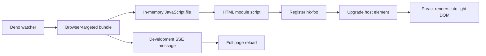

# 0010: Web Components integration with Preact

| Field        | Value              |
| ------------ | ------------------ |
| Status       | Draft              |
| Scope        | Kernel, Experience |
| Created      | 2026-08-02         |
| Last updated | 2026-08-02         |

## Summary

Hyperkernel should evaluate Custom Elements as a framework-neutral browser
boundary for application interface components. The first draft exposes an
abstract `HKElement` base class from a proposed `@hyperkernel/ui` package,
uses Preact to render a `VNode` into the element's light DOM, and leaves
registration with the client entrypoint.

The accompanying delivery experiment uses Deno to produce a browser-targeted
ES module in memory, emits Custom Element hosts from server-rendered HTML, and
reloads the complete page after a successful development rebuild. It
deliberately does not attempt hot module replacement because registrations in
the browser's Custom Element registry cannot be replaced safely.

This record preserves a first design for evaluation. It does not introduce the
`@hyperkernel/ui` package, adopt Deno or Preact in the current application,
replace SvelteKit, define a stable component contract, or claim that the code
shown here has been implemented or verified in this repository.

## Classification

This record is an Experience change because it concerns component authoring,
browser delivery, and development tooling. It also has Kernel scope because
`HKElement`, if published through `@hyperkernel/ui`, would become a public SDK
contract. The experiment does not enter the authoritative write transaction or
change command, event, projection, authorization, persistence, or replay
behavior.

## Relationship to the current frontend decision

[0003: Web-platform-first frontend](0003-web-platform-first-frontend.md) keeps
Svelte and SvelteKit as the chosen application model and currently rejects
Custom Elements without Svelte as the general frontend foundation. This draft
does not override that decision.

The narrower question here is whether Custom Elements can provide a useful
application-facing interoperability boundary while a small renderer supplies
declarative DOM updates inside each element. The experiment must demonstrate a
material benefit over ordinary Svelte components before it can change the
current frontend direction.

## Problem

Hyperkernel wants independently developed applications and interface
components to compose through contracts that remain understandable outside one
frontend framework. Custom Elements provide browser-owned registration,
lifecycle, attribute, property, event, and DOM composition primitives, but they
do not provide a complete declarative rendering or reactive state model.

A local rendering convention can fill that narrow gap, but it creates several
contracts that are easy to leave implicit:

- whether Preact is an implementation detail or part of the author-facing API;
- who owns element registration and lifecycle callbacks;
- whether rendering uses light DOM or Shadow DOM;
- how attributes, properties, events, slots, and styles cross the boundary;
- whether server output contains component content or only an upgradeable host;
- what happens to component state during development reloads;
- how browser and server module graphs remain isolated;
- how bundle, watch, and reload failures remain observable and recoverable;
- how a proposed UI SDK avoids bypassing Hyperkernel's command boundary.

The first experiment needs enough explicit behavior to be tested without
prematurely turning the draft into a general component framework.

## Invariants

1. A module that evaluates `HTMLElement` or `customElements` executes only in a
   browser module graph. Server-side rendering may emit a Custom Element tag
   without importing or evaluating its browser class.
2. Each Custom Element name is registered at most once in one document. A
   development update that changes the class causes a full page reload instead
   of attempting to replace the existing registration.
3. `HKElement.update()` renders only into its own host. One element must not
   mutate another element's DOM or take ownership of the document root.
4. The initial render target is the element's light DOM. Shadow DOM,
   encapsulation, slots, and scoped style behavior are not implied.
5. The server swaps the active in-memory bundle only after a complete
   successful build. A failed rebuild must not publish a partial bundle or
   announce a successful reload.
6. Server-emitted `<hk-foo>` markup is an upgradeable host, not evidence that
   the component itself was server-rendered or hydrated.
7. A full page reload discards transient JavaScript and DOM state. Durable
   user-visible state must be restored through supported Hyperkernel state
   boundaries rather than depending on hot-module preservation.
8. A Custom Element may submit commands and read supported queries. It never
   receives direct authority to mutate authoritative database, event, or
   projection state.
9. Native element, focus, keyboard, form, and accessibility behavior remains
   intact unless the component defines and tests an intentional alternative.
10. Nothing in this Draft is a supported compatibility contract. If element
    names, attributes, properties, events, or `HKElement` become public, their
    evolution must be reviewed as public SDK evolution.

## Proposed direction

### Use the Custom Element as the browser boundary

The browser-facing identity of a component is its registered tag name, such as
`hk-foo`. The client entrypoint imports the implementation and owns the single
`customElements.define()` call. HTML produced by a server, another framework,
or static markup can use that tag without importing Preact.

Registration remains explicit rather than being a side effect of importing the
class. This keeps the global registry mutation visible at the composition root
and lets tests construct the class without necessarily choosing a production
tag name.

Tag names are globally scarce within a document and cannot be undefined. The
`hk-foo` name is illustrative only; a naming and compatibility policy must be
chosen before publishing real application elements.

### Use a minimal Preact-backed base class

The proposed base class has one abstract render contract and one explicit
update operation:

```ts
import { render as preactRender, type VNode } from "preact";

export default abstract class HKElement extends HTMLElement {
  protected abstract render(): VNode;

  update(): void {
    preactRender(this.render(), this);
  }
}
```

The imported renderer is aliased so that it cannot be confused with the
subclass method. `render()` is protected because it describes how the element
builds its own view. `update()` remains public in the first draft, although the
experiment must determine whether external callers need that capability or
whether it should also be protected.

Because subclasses return Preact's `VNode`, Preact is part of the proposed
authoring API rather than a completely private implementation detail. Consumers
using the resulting `hk-*` element do not need Preact, but authors extending
`HKElement` do. A future renderer replacement would therefore require either a
compatibility layer or a new base-class contract.

### Keep lifecycle ownership explicit

The first component asks for its initial render from `connectedCallback()`:

```tsx
import HKElement from "@hyperkernel/ui";

export default class HKFoo extends HKElement {
  connectedCallback(): void {
    this.update();
  }

  protected render() {
    return <p>Hello! This is a custom element.</p>;
  }
}
```

The base class does not yet prescribe `connectedCallback()`,
`disconnectedCallback()`, `adoptedCallback()`, or attribute observation. This
keeps the first abstraction small, but it leaves cleanup, reconnection, and
attribute-driven rendering undefined. The experiment must resolve those
behaviors before the class is published.

### Render into light DOM first

Passing `this` to Preact renders children directly inside the Custom Element.
This keeps the result inspectable, lets document styles and theme tokens reach
the content, and avoids adopting an encapsulation and slotting policy before a
component requires one.

The cost is that component internals are not style-isolated and may be selected
or mutated by surrounding code. Shadow DOM is not rejected permanently, but it
must be introduced only with an explicit accessibility, theming, focus,
server-rendering, and composition contract.

### Keep browser and server module graphs separate

The Deno server bundles `client/main.ts` as a browser-targeted ES module. It
does not import `HKFoo` or `HKElement` into the server module graph. The server
may use Preact's string renderer to emit `<hk-foo>` as inert HTML, and the
browser bundle later registers and upgrades that host.

The initial flow is:



The server file contains JSX and is therefore named `server/main.tsx`. The
current `Deno.bundle()` runtime API is experimental, requires the
`--unstable-bundle` flag, and must be revalidated against the chosen Deno
version before this delivery path is adopted.

### Prefer full reload to component hot replacement

The development client opens an `EventSource` connection to `/dev`. After the
watcher observes a source change and a replacement bundle succeeds, the server
sends a message and the browser calls `location.reload()`.

This intentionally resets the document and its Custom Element registry. It
avoids cache-busted imports that would execute another
`customElements.define("hk-foo", ...)` in the same document and fail. It also
keeps development behavior closer to a clean application startup.

The reload channel is development-only. A production build must not create the
watcher, expose `/dev`, or open the `EventSource` connection.

### Treat outer HTML rendering separately from component SSR

`renderToStaticMarkup()` renders the document shell and the `<hk-foo>` host. It
does not call `HKFoo.render()` on the server and does not serialize its `<p>`
content. The first visible component content is produced after the browser
loads the module and upgrades the element.

If the experiment later requires component HTML before JavaScript executes, it
must define a separate server-rendering and hydration contract. That contract
must prevent duplicate DOM, mismatched markup, and destructive upgrades and
must state whether Declarative Shadow DOM is involved.

## Reference sketch

This sketch normalizes the first draft by using the same `/dev` path on the
client and server, naming the JSX server file `.tsx`, targeting the browser
explicitly, and checking the bundler's success result. It remains illustrative
and unverified in this repository.

```text
ui/HKElement.ts
ui/elements.d.ts
client/components/HKFoo.tsx
client/main.ts
server/main.tsx
deno.json
```

### `ui/elements.d.ts`

```ts
export {};

declare global {
  namespace preact.JSX {
    interface IntrinsicElements {
      "hk-foo": Record<PropertyKey, never>;
    }
  }
}
```

The declaration is shared because both the browser entrypoint and the
server-rendered shell use `<hk-foo />` in separate module graphs.

### `client/main.ts`

```ts
import type {} from "../ui/elements.d.ts";
import HKFoo from "./components/HKFoo.tsx";

customElements.define("hk-foo", HKFoo);

// Development entrypoints only.
new EventSource("/dev").addEventListener("message", () => {
  location.reload();
});
```

The JSX declaration allows `<hk-foo />` but deliberately defines no attributes
yet.

### `server/main.tsx`

```tsx
import type {} from "../ui/elements.d.ts";
import { renderToStaticMarkup } from "preact-render-to-string";

const client = {
  files: [] as Array<File>,

  async bundle(): Promise<void> {
    const result = await Deno.bundle({
      entrypoints: ["./client/main.ts"],
      platform: "browser",
      format: "esm",
      write: false,
    });

    result.warnings.forEach((warning) => console.info(warning.text));

    if (!result.success) {
      throw new Error(result.errors[0]?.text ?? "Client bundle failed");
    }

    if (!result.outputFiles) {
      throw new Error("Client bundle generated no output files");
    }

    const replacement = result.outputFiles.map(
      (output) =>
        new File([output.text()], output.hash, {
          type: "text/javascript;charset=utf-8",
        }),
    );

    this.files = replacement;
  },
};

await client.bundle();

const server = Deno.serve((request) => {
  const url = new URL(request.url);
  const file = client.files.find(
    (candidate) => candidate.name === url.pathname.slice(1),
  );

  if (file) {
    return new Response(file, {
      headers: {
        "Cache-Control": "no-cache",
        "Content-Type": file.type,
      },
    });
  }

  if (url.pathname === "/dev") {
    const encoder = new TextEncoder();
    const watcher = Deno.watchFs("./client");

    const body = new ReadableStream<Uint8Array>({
      start(controller) {
        void (async () => {
          try {
            for await (const event of watcher) {
              await client.bundle();
              controller.enqueue(
                encoder.encode(
                  `data: ${JSON.stringify({
                    type: "SOURCE_CHANGED",
                    payload: event,
                  })}\n\n`,
                ),
              );
            }
          } catch (error) {
            controller.error(error);
          }
        })();
      },

      cancel() {
        watcher.close();
      },
    });

    return new Response(body, {
      headers: {
        "Content-Type": "text/event-stream",
        "Cache-Control": "no-store",
      },
    });
  }

  const html = renderToStaticMarkup(
    <html lang="en">
      <head>
        <meta charset="utf-8" />
        {client.files.map((file) => (
          <script key={file.name} type="module" src={`/${file.name}`} />
        ))}
      </head>
      <body>
        <main>
          <hk-foo />
        </main>
      </body>
    </html>,
  );

  return new Response(`<!doctype html>\n${html}`, {
    headers: {
      "Content-Type": "text/html;charset=utf-8",
    },
  });
});

Deno.addSignalListener("SIGINT", async () => {
  await server.shutdown();
});
```

### `deno.json`

```json
{
  "compilerOptions": {
    "lib": [
      "dom",
      "dom.iterable",
      "dom.asynciterable",
      "deno.ns",
      "deno.unstable"
    ],
    "jsx": "react-jsx",
    "jsxImportSource": "preact"
  },
  "imports": {
    "@hyperkernel/ui": "./ui/HKElement.ts",
    "preact": "npm:preact@^10",
    "preact-render-to-string": "npm:preact-render-to-string@^6",
    "zod": "npm:zod@^4.4.3"
  }
}
```

Zod is retained from the surrounding experiment configuration but is not used
by this first component or delivery path. Its presence does not define an
attribute, property, or event validation contract.

The local `@hyperkernel/ui` mapping is illustrative. Publishing a real package
would require an exports, versioning, compatibility, and release contract.

## Failure, recovery, and concurrency behavior

### Initial bundle failure

The server must fail startup rather than serve HTML that references no usable
client module. Warnings may be reported without failing the build; bundler
errors are fatal.

### Rebuild failure

The active bundle remains the last complete successful bundle because the
replacement array is assigned only after every output is created. The first
draft closes the affected SSE stream on an exception. A broader development
server should instead report a structured build failure to connected clients
and continue watching so that the next edit can recover without restarting the
server.

### Multiple browser connections

The sketch creates one filesystem watcher per `/dev` connection. Multiple open
tabs therefore duplicate watchers and rebuild work and may race to replace the
same in-memory file list. This is acceptable only as a single-client spike. A
reusable development server must own one process-wide watcher, serialize or
coalesce rebuilds, and broadcast the result to all clients.

### Source-event bursts

One logical edit may produce several filesystem events. The first draft may
therefore perform redundant sequential builds and reloads. Debouncing or
coalescing may be added only as development tooling; it must not make the
published bundle state ambiguous.

The watcher also covers only `./client`, while the browser graph imports the
proposed `./ui` source. A usable implementation must watch every local source
root that can affect the browser bundle or derive its watch set from the module
graph.

### Disconnection and shutdown

Cancelling one stream closes its watcher. Process shutdown stops the HTTP
server on `SIGINT`. The experiment must verify watcher cleanup, aborted client
connections, failed enqueues, and the behavior of platforms where the selected
signal contract differs.

### Element removal and reconnection

The first base class has no unmount policy. Removing a rendered element may
leave Preact lifecycle cleanup undefined, and reconnecting it calls `update()`
again. Before adoption, tests must determine whether the base class should
unmount in `disconnectedCallback()`, preserve its rendered tree for temporary
disconnection, or delegate that choice explicitly to each subclass.

## Security boundary

The development server reads the client source tree, evaluates bundler tooling,
serves generated JavaScript, and exposes filesystem event metadata through
SSE. It must bind and run only in an explicitly configured development context.
Source paths or other unnecessary filesystem details should not be exposed to
untrusted remote clients.

Browser components remain untrusted presentation and extension code relative
to authoritative Hyperkernel state. Inheriting from `HKElement` grants no
database, event-log, projection-table, command-authorization, filesystem, or
server capability.

Preact, its string renderer, Deno's experimental bundler, and their npm module
graphs enter the development or runtime supply-chain boundary. Versions must be
locked and upgrades reviewed before the experiment becomes a supported path.

## Considered solutions

### Continue with Svelte and SvelteKit only

This remains the current repository decision and has the lowest immediate
integration cost. It provides the established reactive, rendering,
server-rendering, routing, and build model.

It does not by itself test whether a browser-standard Custom Element boundary
would improve application interoperability or reduce consumer coupling to
Svelte. The experiment may proceed only as a bounded comparison, not as a
parallel production stack by default.

### Custom Elements with a Preact authoring base

This is the proposed experiment. It gives consumers a standard DOM element and
gives authors a small declarative rendering surface. Preact's compact API keeps
the first base class understandable.

It couples component authors to Preact `VNode`, leaves reactivity and lifecycle
policy largely undefined, and introduces another renderer beside Svelte. Those
costs are acceptable for evaluation but not yet justified for production.

### Custom Elements with imperative DOM updates

This would remove Preact and keep the authoring model entirely on Web Platform
APIs. It is attractive for very small elements.

It is not selected for the first experiment because repeated structured DOM
updates, event listener ownership, and nested composition would require local
rendering conventions immediately. It remains the baseline comparison for a
component simple enough not to need a renderer.

### Svelte-compiled Custom Elements

Svelte can compile components as Custom Elements and would avoid introducing a
second rendering model. It may fit the existing toolchain better.

It is not selected by this first draft because the experiment specifically
tests whether a minimal `HTMLElement` contract plus Preact is understandable
and portable. A concrete comparison with Svelte-compiled elements is required
before adopting a second renderer.

### Lit or another Custom Element framework

A dedicated framework could provide reactive properties, lifecycle helpers,
templating, style conventions, and SSR-related tooling.

This is not selected because it would add a broader public vocabulary before
the experiment has proven which capabilities are missing. If the local base
class starts recreating those features, the decision must be revisited instead
of growing an undocumented framework.

### Hot module replacement

A permanent wrapper class or framework-specific indirection could preserve the
registered Custom Element while swapping an internal implementation.

This is rejected for the first draft. It adds identity, state-transfer, cleanup,
and failure cases that are unrelated to proving the component boundary. Full
reload is deterministic and makes state-loss behavior honest.

## Consequences

### Gains

- Consumers can instantiate the component through standard HTML and DOM APIs.
- Element registration and browser/server execution boundaries remain explicit.
- The authoring abstraction is small enough to inspect completely.
- Full reload avoids stale Custom Element registrations during development.
- Light DOM keeps markup and theme inheritance visible to surrounding tools.

### Costs and limitations

- The repository would operate Preact and a Deno delivery experiment beside its
  chosen SvelteKit stack.
- `VNode` makes Preact part of the subclass contract.
- The draft defines no reactive state, attribute/property reflection, typed
  events, forms, slots, cleanup, error boundary, or hydration behavior.
- A successful bundle is not evidence that the source module graph passed type
  checking; `deno check` remains a separate verification step.
- Light DOM provides no style or mutation encapsulation.
- Server rendering currently emits only an empty host.
- Full reload loses transient state and can make frequent edits slower.
- The single-client watcher design does not scale to multiple tabs or users.

### Maintenance cost

If adopted, maintainers must test browser lifecycle behavior, Preact upgrades,
Custom Element name and DOM compatibility, TypeScript JSX declarations, Deno
bundler changes, server/client module isolation, development connection cleanup,
and interoperability with Svelte and plain HTML.

### Operational complexity

The production component boundary itself needs no additional server process,
but the proposed delivery path owns an experimental bundler, in-memory asset
catalog, filesystem watcher, SSE endpoint, cache policy, and shutdown behavior.
Those concerns should remain development-only unless a production advantage is
demonstrated.

### Scaling implications

Independent elements can be composed across a document, but each Preact root
adds lifecycle and rendering work. A large number of fine-grained elements may
increase bundle, registration, rendering, and coordination overhead. The
development server's per-connection watcher is explicitly non-scalable and
must be replaced before multi-client use.

## Open questions

- Is the intended stable boundary the `hk-*` DOM contract, the `HKElement`
  subclass API, or both?
- Does any external caller need public `update()`, or should only the element
  and its subclasses request renders?
- What causes an update after the initial connection?
- How are attributes and properties validated, reflected, and converted?
- How are typed DOM events named, versioned, and prevented from masquerading as
  authoritative domain events?
- What lifecycle cleanup does Preact require when an element disconnects and
  later reconnects?
- Is light DOM sufficient for theming and composition, or does a representative
  component justify Shadow DOM?
- How do Svelte applications consume and test the element without duplicate
  state ownership?
- Does server-rendered component content provide enough value to justify a
  hydration contract?
- Should development assets use content-addressed immutable caching rather than
  a hash name with `no-cache`?
- Should Deno remain only an isolated experiment, or is there a justified path
  from the repository's Node/SvelteKit runtime to this delivery model?

## Decision boundary

This Draft authorizes only an isolated experiment. It does not authorize a
second production frontend stack, a new public package, or migration away from
SvelteKit.

The record should advance to Development only if a representative component
demonstrates that the Custom Element boundary provides concrete interoperability
or compatibility value that ordinary Svelte components do not provide. That
decision must also choose whether Preact is an accepted public authoring
dependency and how the experiment integrates with or replaces part of the
current toolchain.

If the value is limited to a small number of external integration points, the
preferred outcome may be to expose only those points as Custom Elements while
retaining Svelte for the primary interface. If the base class grows reactive
state, scheduling, styling, event, or lifecycle machinery, compare it with
Svelte-compiled Custom Elements and Lit before adding more local abstraction.

## Evaluation

This record may advance to Development only after the experiment provides:

- a runnable implementation isolated from the current production application;
- type checking for browser, server, and shared JSX declarations;
- a browser test covering registration, upgrade, initial rendering, removal,
  reconnection, and duplicate-registration failure;
- a documented attribute, property, event, and update trigger for one real
  component;
- evidence that light DOM styling and accessibility behave as intended;
- proof that server code never evaluates browser-only globals;
- initial-build failure and successful-rebuild tests;
- a failed-rebuild recovery path that retains the last good bundle;
- one process-wide watcher with rebuild coalescing and multi-client broadcast,
  or an explicit decision to keep the tooling single-client;
- verification that full reload restores all durable user-visible state needed
  by the representative workflow;
- measured bundle output and comparison with the equivalent Svelte component;
- a production delivery decision that does not expose development SSE or
  filesystem details;
- compatibility review for the selected Deno and Preact versions;
- review and approval by an experienced human maintainer for the proposed
  public SDK contract.

It may advance to Evaluation only after the selected boundary works end to end
in a representative Hyperkernel application and its lifecycle, accessibility,
failure, browser compatibility, and Svelte interoperability tests pass.

## References

- [Hyperkernel public architecture](../../README.md)
- [Hyperkernel engineering contracts](../../AGENTS.md)
- [0003: Web-platform-first frontend](0003-web-platform-first-frontend.md)
- [Deno bundling](https://docs.deno.com/runtime/reference/bundling/)
- [Deno bundler API](https://docs.deno.com/api/deno/bundler/)
- [MDN: Using custom elements](https://developer.mozilla.org/en-US/docs/Web/API/Web_components/Using_custom_elements)
- [Preact: Web Components](https://preactjs.com/guide/v10/web-components/)

## Status history

| Date       | Status | Reason                                                     |
| ---------- | ------ | ---------------------------------------------------------- |
| 2026-08-02 | Draft  | Initial Deno, Preact, and Custom Elements design recorded. |
